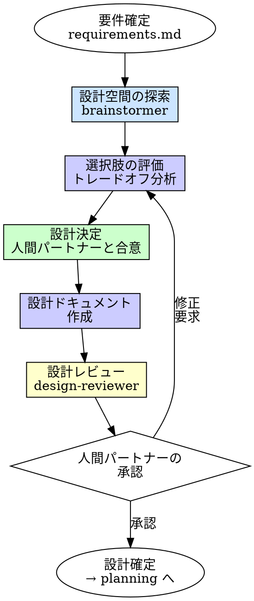

# Brainstorming（設計・ブレスト）

## 概要

要件が確定した後、コードを書く前に設計を固める。
設計空間を探索し、選択肢を比較し、技術的意思決定を記録する。

**入力:** REQ パス（例: `requirements/REQ-001/`）+ 承認済みの `requirements.md` 全文
**出力:** `requirements/REQ-*/design.md`（承認済み設計ドキュメント）

**原則:** 最初に思いついた設計で実装を始めるのは、最初に見つけた道で山を登るのと同じだ。

## Iron Law

```
設計承認なしにコードを書くな
```

要件があるから設計は自明？ それは設計を省略する言い訳だ。

- 「頭の中で設計は済んでいる」→ 頭の中の設計は他人に伝わらない
- 「小さい変更だから設計不要」→ 小さい変更でもアプローチの選択肢はある
- 「実装しながら設計する」→ サンクコストで最初のアプローチに固着する
- 「前と同じパターンだから」→ 前と同じ文脈とは限らない

タスクサイズによらず設計を行う。タスクが小さければ書く量が少なくなるだけで、プロセスは同じ。

## いつ使うか

**常に:**
- 新機能の実装前（requirements 完了後）
- アーキテクチャに影響する変更
- 複数のアプローチが考えられる場合

**例外（人間パートナーに確認すること）:**
- 既存パターンの機械的な適用（CRUD の追加等）
- バグ修正（原因が特定済みで修正方針が明らか）

## プロセス



### 1. 設計空間の探索

`brainstormer` に設計の選択肢を探索させる。

探索の観点:
- **アーキテクチャ**: モジュール構成、レイヤー分割、依存方向
- **インターフェース**: API 設計、関数シグネチャ、データ構造
- **技術選定**: ライブラリ、パターン、アルゴリズム
- **既存コードとの統合**: 既存モジュールの活用、拡張ポイント

brainstormer は最低2つ、最大4つの選択肢を提示する。各選択肢にトレードオフを付記する。

### 2. 選択肢の評価

brainstormer の報告をもとに、選択肢を評価する。

評価基準:

| 基準 | 内容 |
|------|------|
| **要件適合** | 全 FR を実現できるか |
| **シンプルさ** | 最小限の複雑さで実現できるか |
| **拡張性** | 将来の要件変更に対する影響範囲 |
| **既存コードとの整合** | 既存のパターン・規約に沿っているか |
| **テスト容易性** | TDD で進めやすい構造か |

**注意**: 将来の拡張性のために今の複雑さを増やすな。YAGNI。現在の要件に対して最もシンプルな選択肢を優先する。

### 3. 設計決定

評価結果を人間パートナーに提示し、設計方針を合意する。

- 選択肢ごとの pros/cons を簡潔に示す
- 推奨案を1つ提示し、理由を述べる
- 人間パートナーが別の選択肢を選んでもよい

### 4. 設計ドキュメントの作成

合意した設計を構造化してドキュメントにまとめる。

### 5. 設計レビュー

`design-reviewer` に設計ドキュメントと requirements.md を渡し、以下を検証する:

- 全 FR が設計でカバーされているか
- 設計がスコープ（やること/やらないこと）に沿っているか
- 前提・制約に違反していないか

### 6. 人間パートナーの承認

設計ドキュメントを人間パートナーに提示し、承認を得る。

## 出力ファイル構成

対応する REQ ディレクトリ内に設計ドキュメントを作成する:

```
requirements/REQ-001-user-register/
  requirements.md   # （既存）
  context.md        # （既存）
  design.md         # ★設計ドキュメント
```

## design.md テンプレート

```markdown
---
status: Draft | Approved
owner: [担当者]
last_updated: YYYY-MM-DD
---

# REQ-001: <タイトル> — 設計

## 設計概要
[選択した設計アプローチの要約。1-3文]

## アーキテクチャ
[モジュール構成、レイヤー分割、依存方向]
- 変更/追加するモジュール
- モジュール間の依存関係

## インターフェース設計
[API、関数シグネチャ、データ構造]

### [コンポーネント/関数名]
- **入力**: [型・形式]
- **出力**: [型・形式]
- **責務**: [何をするか]

## データ設計（該当する場合のみ）
[データモデル、スキーマ変更、状態管理]

## 設計判断

| 判断 | 選択 | 理由 | 却下した代替案 |
|------|------|------|--------------|
| [何を決めたか] | [選んだもの] | [なぜ選んだか] | [他に何を検討したか] |

## 影響範囲
- **変更対象**: [ファイル/モジュール]
- **新規作成**: [ファイル/モジュール]
- **依存する既存コード**: [影響を受ける箇所]

## 未解決事項（あれば）
- [ ] [実装時に判明する可能性がある事項]
```

## よくある合理化

| 言い訳 | 現実 |
|--------|------|
| 「設計は自明だ」 | 自明に見える設計ほど暗黙の前提を含んでいる |
| 「実装しながら設計する」 | 最初のアプローチにサンクコストで固着する |
| 「設計ドキュメントはすぐ古くなる」 | 判断の記録は古くならない。「なぜこう設計したか」は永続する |
| 「1つしかやり方がない」 | 1つしか思いつかないのと、1つしかないのは違う |
| 「時間がない」 | 設計なしの実装は手戻りでもっと時間がかかる |
| 「アジャイルだから事前設計は不要」 | アジャイルでもスプリント内の設計は行う |

## 危険信号

以下のどれかに当てはまったら、**設計を見直せ。**

- [ ] 選択肢を1つしか検討していない
- [ ] 設計が要件の全 FR をカバーしていない
- [ ] 既存コードとの整合を確認していない
- [ ] 「将来のため」に今の複雑さを増やしている
- [ ] 人間パートナーの承認を得ていない
- [ ] 設計判断に理由が書かれていない

## 例: ユーザー登録 API の設計

**requirements.md より:**
- FR-1: ユーザー登録（POST /users, email+password+displayName）
- 制約: Express + PostgreSQL, bcrypt

**brainstormer の探索結果:**

| 選択肢 | 概要 | Pros | Cons |
|--------|------|------|------|
| A. ルーター直書き | router に全ロジック | シンプル、ファイル少 | テストしにくい、責務混在 |
| B. 3層分離 | router → service → repository | テスト容易、責務明確 | ファイル数が増える |
| C. CQRS | Command/Query 分離 | 読み書き独立にスケール | 登録のみには過剰 |

**設計決定:** B（3層分離）
- 理由: FR-1 の入力バリデーション・ハッシュ化・保存を分離でき、TDD で進めやすい
- C は現在の要件（登録1エンドポイント）に対して過剰

**design.md:**
```markdown
---
status: Approved
owner: sizukutamago
last_updated: 2026-03-31
---

# REQ-001: ユーザー登録 API — 設計

## 設計概要
3層分離（router → service → repository）で実装する。
バリデーション・ビジネスロジック・データアクセスを分離し、TDD で各層を独立にテスト可能にする。

## アーキテクチャ
- `routes/users.ts` — ルーティング + バリデーション
- `services/userService.ts` — ビジネスロジック（ハッシュ化、重複チェック）
- `repositories/userRepository.ts` — DB アクセス

## インターフェース設計

### userService.createUser
- 入力: { email: string, password: string, displayName: string }
- 出力: { id: string, email: string, displayName: string }
- 責務: パスワードハッシュ化 + リポジトリ呼び出し

### userRepository.create / findByEmail
- create: ユーザーレコードの挿入
- findByEmail: メールによる既存ユーザー検索（重複チェック用）

## 設計判断

| 判断 | 選択 | 理由 | 却下した代替案 |
|------|------|------|--------------|
| アーキテクチャ | 3層分離 | TDD容易 + 責務明確 | ルーター直書き（テスト困難）、CQRS（過剰） |
| バリデーション位置 | ルーター層 | リクエスト境界で早期に弾く | サービス層（HTTPの関心がサービスに漏れる） |

## 影響範囲
- 新規作成: routes/users.ts, services/userService.ts, repositories/userRepository.ts
- 依存: Express Router, bcrypt, PostgreSQL client
```

## 検証チェックリスト

設計確定前に確認:

- [ ] 最低2つの選択肢を検討した
- [ ] 各 FR が設計でカバーされている
- [ ] 設計がスコープ（やること/やらないこと）に沿っている
- [ ] 前提・制約に違反していない
- [ ] 設計判断に理由が記録されている
- [ ] 既存コードとの整合を確認した
- [ ] 人間パートナーの承認を得ている

## 行き詰まった場合

| 問題 | 解決策 |
|------|--------|
| 選択肢が1つしか思いつかない | brainstormer に制約を変えた場合の代替案を探索させる |
| どの選択肢も一長一短で決められない | 評価基準に優先順位をつける。要件適合 > シンプルさ > テスト容易性 |
| 既存コードのパターンと合わない | 既存パターンを踏襲するか、移行計画を含めるか人間パートナーに確認 |
| 設計が大きくなりすぎる | タスクが大きすぎる。requirements に戻って分割を検討 |
| design-reviewer が FR の未カバーを指摘する | 設計を修正して FR をカバーする。FR 自体が不要なら requirements に戻る |

## 委譲指示

あなたはこのスキルの評価・決定プロセスを自分で実行する。ただし探索とレビューは委譲する。

**前提: 対応する REQ を特定する。** ディスパッチ前に、このタスクに対応する `requirements/REQ-*/requirements.md` を特定しろ。タスクのコンテキスト（直前のステップの出力）に REQ パスが含まれていればそれを使う。見つからなければ `requirements/` を確認し、候補を人間パートナーに AskUserQuestion で提示して選択してもらう。**推測で REQ を決めるな。必ず人間に確認しろ。**

1. **`brainstormer` エージェントをディスパッチして設計空間を探索する**
   - プロンプトに REQ パス + 対応する REQ の requirements.md 全文 + 関連する既存コードの構造・パターンを含める
   - **コンテキストはプロンプトに全文埋め込む。** エージェントにファイルを読ませるな
   - `brainstormer` は最低2つ、最大4つの選択肢をトレードオフ付きで報告する

2. **あなたが選択肢を評価し、推奨案を人間パートナーに提示する**
   - 各選択肢の pros/cons を簡潔にまとめる
   - 要件適合 > シンプルさ > テスト容易性 の優先順位で推奨案を選ぶ
   - AskUserQuestion で人間パートナーに設計方針の合意を得る

3. **設計ドキュメントを作成する**
   - 合意した設計を design.md テンプレートに従って構造化する
   - `requirements/REQ-*/design.md` に出力する

4. **`design-reviewer` エージェントをディスパッチして設計をレビューする**
   - プロンプトに REQ パス + design.md 全文 + 対応する requirements.md 全文を含める
   - **コンテキストはプロンプトに全文埋め込む。** エージェントにファイルを読ませるな
   - `design-reviewer` は設計の要件カバレッジと制約整合性を検証する

5. **レビュー結果に対応する**
   - MUST 指摘あり → 設計を修正して再レビュー（最大2回）
   - MUST 指摘なし → 人間パートナーに最終承認を依頼する

6. **承認後、次のステップに進む**
   - タスク分解が必要 → planning へ
   - すぐ実装できる → tdd へ

## Integration

**前提スキル:**
- **requirements** — 承認済みの requirements.md が存在すること

**次のステップ:**
- **planning** — 設計をタスクに分解する
- **tdd** — 小さいタスクで分解不要ならそのまま実装へ

**このスキルの出力を参照するエージェント:**
- **planner** — 設計を元にタスク分解する
- **implementer** — インターフェース設計を実装の基準にする
- **spec-compliance-reviewer** — 設計判断と実装の整合を確認する
