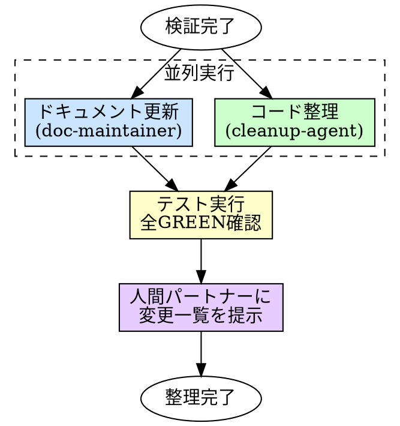

# Cleanup（整理）

## 概要

コミットする前に、ワーキングツリーを整理する。
実装中に残った不要物を除去し、ドキュメントを実装の最終状態に合わせて更新する。

**入力:** REQ パス（例: `requirements/REQ-001/`）+ 検証完了済みの実装コード + テストコード + 検証報告書
**出力:** 整理済みのワーキングツリー + 更新済みドキュメント

**原則:** コミットは「完成品の記録」だ。作業の残骸を含めるな。

## Iron Law

```
不要ファイルを残したままコミットするな
```

デバッグコード、一時ファイル、対応済み TODO、使われていない import ——これらは実装の副産物であり、成果物ではない。

- 「後で消す」→ 後で消されるファイルは永遠に残る
- 「念のため残す」→ 念のため残したコードは混乱を生む
- 「小さいから気にしない」→ 小さいゴミが100個あるとゴミ屋敷になる

## いつ使うか

**常に:**
- verification（[9]）が完了した後
- コミット・PR（[11]）に進む前

**例外（人間パートナーに確認すること）:**
- WIP コミット（作業途中の一時的なコミット）

## プロセス



### 1. コード整理（cleanup-agent）

lint/formatter では対応できない不要物をワーキングツリーから除去する。
未使用 import・変数、console.log、debugger 等は lint の責務。cleanup-agent は扱わない。

| 対象 | アクション |
|------|----------|
| 一時ファイル | `.tmp`, `.bak`, `.orig`, テスト用の一時出力等を削除 |
| 対応済み TODO/FIXME | 削除（対応済みであることを検証報告書で確認） |
| コメントアウトされたコードブロック | 削除（Git に履歴がある。文脈を見て判断） |
| 空ディレクトリ | 削除 |

**削除しないもの:**
- 未対応の TODO/FIXME（意図的に残されている）
- `.gitkeep`（空ディレクトリの保持用）
- 設定ファイル（`.env.example` 等）
- lint/formatter が扱う項目（未使用 import、デバッグ文等）

### 2. ドキュメント更新（doc-maintainer）

実装の最終状態に合わせてドキュメントを更新する。

| 対象 | アクション |
|------|----------|
| README | 新機能の使い方・設定項目を追記 |
| API ドキュメント | エンドポイント・パラメータの変更を反映 |
| CHANGELOG | 変更内容を記録（プロジェクトにある場合） |
| 設定ファイルの例 | `.env.example` 等に新しい環境変数を追記 |
| requirements.md の status | `status: verified` → `status: done` に更新 |

**更新しないもの:**
- 自動生成ドキュメント（API リファレンス等。ビルドで再生成する）
- 変更と関係ないドキュメント

### 3. テスト実行

整理後にテストスイート全体を実行し、整理が何も壊していないことを確認する。

### 4. 人間パートナーに変更一覧を提示

整理内容を人間パートナーに提示する。

```
## 整理内容

### コード整理
- 削除: [ファイル名:行番号] console.log 3箇所
- 削除: [ファイル名] 未使用の import 2件
- 削除: [ファイル名:行番号] 対応済み TODO 1件

### ドキュメント更新
- 更新: README.md — 新機能の使い方を追記
- 更新: .env.example — 新しい環境変数を追記

### テスト結果
- 全 GREEN（N件）
```

## よくある合理化

| 言い訳 | 現実 |
|--------|------|
| 「コメントアウトしたコードは参考になる」 | Git の履歴を見ろ。コメントアウトは読む人を混乱させる |
| 「TODO は後で対応する」 | 対応済みの TODO は嘘のコメント。未対応なら Issue にしろ |
| 「ドキュメントは後で書く」 | 後で書くドキュメントは永遠に書かれない |
| 「小さい変更だから整理不要」 | 小さい変更の積み重ねがゴミ屋敷を作る |

## 危険信号

以下のどれかに当てはまったら、**やり方を見直せ。**

- [ ] 一時ファイルを残したままコミットしようとした
- [ ] コメントアウトされたコードを「念のため」残した
- [ ] 対応済み TODO を削除していない
- [ ] ドキュメントを更新せずにコミットしようとした
- [ ] 整理後にテストを実行していない
- [ ] lint/formatter が扱う項目を手動で修正した

## 検証チェックリスト

整理完了前に確認:

- [ ] 一時ファイル（.tmp, .bak, .orig 等）を除去した
- [ ] 対応済み TODO/FIXME を全て除去した
- [ ] コメントアウトされたコードブロックを除去した
- [ ] 空ディレクトリを除去した
- [ ] ドキュメントを実装の最終状態に合わせて更新した
- [ ] テストスイート全体が GREEN
- [ ] 人間パートナーに変更一覧を提示した

## 行き詰まった場合

| 問題 | 解決策 |
|------|--------|
| 削除していいか判断できない | 人間パートナーに聞く。迷ったら残す |
| 整理後にテストが RED になった | 整理が振る舞いを変えている。変更を元に戻して原因を特定 |
| ドキュメントの更新範囲がわからない | 変更した機能に関連するドキュメントだけ。無関係なドキュメントは触らない |
| TODO が対応済みか判断できない | 検証報告書の FR/AC 充足状況と突き合わせる |

## 委譲指示

あなたはこのスキルのプロセスを自分で実行しない。以下のエージェントにディスパッチする。

**前提: 対応する REQ を特定する。** ディスパッチ前に、このタスクに対応する `requirements/REQ-*/requirements.md` を特定しろ。タスクのコンテキスト（plan、直前のステップの出力）に REQ パスが含まれていればそれを使う。見つからなければ `requirements/` を確認し、候補を人間パートナーに AskUserQuestion で提示して選択してもらう。**推測で REQ を決めるな。必ず人間に確認しろ。**

1. **`cleanup-agent` と `doc-maintainer` を並列ディスパッチする**
   - `cleanup-agent`: プロンプトに REQ パス + 変更対象ファイル一覧 + 検証報告書を含める
   - `doc-maintainer`: プロンプトに REQ パス + requirements.md 全文 + 変更対象ファイル一覧 + 検証報告書を含める
   - **コンテキストはプロンプトに全文埋め込む。** エージェントにファイルを読ませるな
   - 両エージェントは独立した対象を扱うため並列実行して安全

2. **`test-runner` エージェントをディスパッチしてテスト全体実行**
   - 両エージェントの完了後、テストスイート全体を実行して GREEN を確認する
   - RED の場合、原因が cleanup の変更か doc-maintainer の変更かを切り分ける

3. **あなたが結果を判断し、人間パートナーに変更一覧を提示する**
   - 全テスト GREEN → 変更一覧を提示して承認を得る
   - テスト RED → 原因を特定し、該当エージェントに修正を再ディスパッチ
   - NEEDS_CONTEXT / BLOCKED → エスカレーション判断ツリーに従う

## Integration

**前提スキル:**
- **verification** — 検証完了であること

**必須ルール:**
- **coding-style** — コーディングルール（常時適用）

**次のステップ:**
- **commit** — コミット・PR（[11]）
