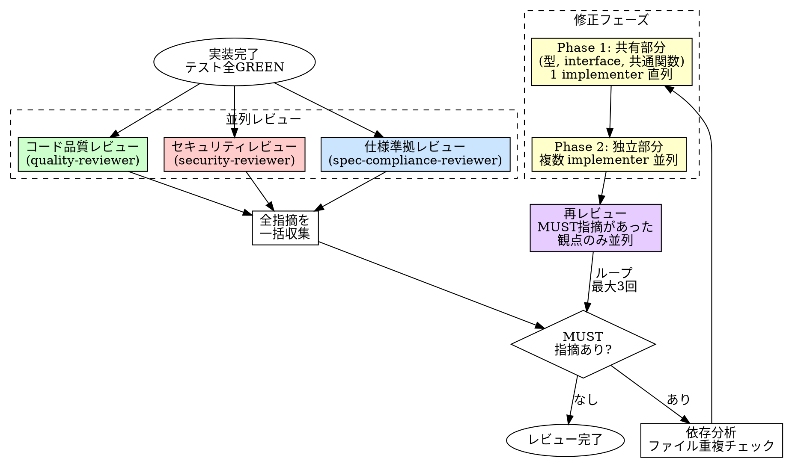

# Code Review（3観点レビュー）

## 概要

実装者とは別のエージェントが、3つの独立した観点でコードをレビューする。
実装者バイアスを排除し、仕様との乖離・品質劣化・脆弱性を検出する。

**入力:** REQ パス（例: `requirements/REQ-001/`）+ テスト全 GREEN の実装コード + `requirements.md` 全文
**出力:** 3観点のレビュー報告（MUST/SHOULD/CONSIDER 指摘）+ 修正済みコード

**原則:** 実装した者がレビューしても、自分の思い込みは見つけられない。

## Iron Law

```
3観点レビュー（仕様→品質→セキュリティ）を省略するな
```

1段階でも飛ばした？ それはレビューではない。チェックリストの消化だ。

- 「仕様レビューは不要、自明だから」→ 自明なバグが一番多い
- 「セキュリティは関係ない」→ 関係ないと思った箇所が攻撃される
- 「小さい変更だから品質レビューは省略」→ 小さい変更が技術的負債を積む

3観点レビュー（仕様・品質・セキュリティ）を実施する。

## いつ使うか

**常に:**
- 機能実装の完了後
- バグ修正の完了後
- リファクタリングの完了後

**例外（人間パートナーに確認すること）:**
- ドキュメントのみの変更
- 設定ファイルのみの変更
- 自動生成コードの更新

## プロセス



### 並列レビュー（3観点同時実行）

3つのレビュアーは独立した観点を持つ。同じコードを読むだけ（read-only）なので並列実行する。

#### 仕様準拠レビュー（spec-compliance-reviewer）

実装が要件・仕様を満たしているかを検証する。

- 要件に記載された全機能が実装されているか
- エッジケース・異常系が要件通りに処理されているか
- API の入出力が仕様と一致しているか
- テストが仕様の振る舞いをカバーしているか

#### コード品質レビュー（quality-reviewer）

コードの保守性・可読性・設計品質を検証する。

- 命名は意図を正確に表しているか
- 関数・モジュールの責務は単一か
- 不要な複雑さ（過剰な抽象化、不要なパターン適用）がないか
- 重複コードがないか
- エラーハンドリングは適切か

#### セキュリティレビュー（security-reviewer）

セキュリティ上の脆弱性がないかを検証する。

- OWASP Top 10（インジェクション、認証不備、XSS 等）
- シークレット・認証情報のハードコード
- 入力バリデーションの不備
- 安全でないデシリアライゼーション
- 過剰な権限・情報露出

### 修正フェーズ（依存解決パターン）

MUST 指摘がある場合、修正前に依存分析を行う。

1. **依存分析**: 全 MUST 指摘の affected files を洗い出し、ファイル重複をチェック
2. **Phase 1 — 共有部分を直列修正**: 型定義・interface・共通関数など、複数の指摘が依存する共有レイヤーを 1 implementer で先に修正する
3. **Phase 2 — 独立部分を並列修正**: ファイルが重複しない指摘群を複数 implementer で並列修正する

MUST 指摘が少数（3件以下）かつ affected files が少ない場合は、依存分析をスキップして 1 implementer にまとめて渡してよい。

## レビューループ上限

```
修正 → 再レビュー: 最大3回
3回修正しても通らない場合:
  ├─ 仕様レビュー不合格 → タスク分割を検討 or 人間エスカレート
  └─ 品質/セキュリティレビュー不合格 → Opus で1回リトライ → ダメなら人間エスカレート
```

最大4回（通常3回 + モデルエスカレート1回）で打ち切り。
無限ループに入るな。3回目の修正で同じ指摘が出たら、根本的な設計問題だ。

## 良いレビュー指摘

| 品質 | 良い | 悪い |
|------|------|------|
| **具体的** | 「L42: null チェックが漏れている。`user` が undefined の場合に例外が発生する」 | 「エラーハンドリングが甘い」 |
| **修正案付き** | 問題 + 修正の方向性を提示 | 問題の指摘だけで終わる |
| **根拠あり** | ルール・仕様・脆弱性 DB を根拠に指摘 | 「なんとなく良くない」 |
| **優先度明示** | MUST / SHOULD / CONSIDER で分類 | 全部同じ重みで列挙 |
| **再現可能** | 具体的な入力やシナリオで再現手順を示す | 「こういうケースがありそう」 |

## よくある合理化

| 言い訳 | 現実 |
|--------|------|
| 「テストが通っているからレビュー不要」 | テストは仕様の一部しかカバーしない。レビューは別の観点を持つ |
| 「小さい変更だからスキップ」 | 1行の変更でセキュリティホールは作れる |
| 「急いでいるからレビューは後で」 | 後でやるレビューは永遠に来ない |
| 「自分でレビューした」 | 実装者バイアスで自分のミスは見えない |
| 「セキュリティは内部ツールだから関係ない」 | 内部ツールも攻撃対象になる。SSRF、権限昇格 |
| 「前回と同じパターンだからレビュー不要」 | 同じパターンでも文脈が違えばバグは違う |

## 危険信号

以下のどれかに当てはまったら、**レビュープロセスをやり直せ。**

- [ ] 3観点のうち1つでもスキップした
- [ ] レビュー指摘を「些細だから」と無視した
- [ ] 修正後に再レビューせず完了とした
- [ ] レビュアーに十分なコンテキストを渡していない
- [ ] MUST 指摘が残ったままマージしようとした
- [ ] 「今回だけ」と合理化した

## 例: API エンドポイント追加

**Stage 1 - 仕様準拠レビュー:**
```
MUST: POST /users のレスポンスに id フィールドがない（仕様では必須）
SHOULD: エラーレスポンスの形式が仕様の ErrorResponse スキーマと不一致
```

**Stage 2 - 品質レビュー:**
```
MUST: createUser 関数が80行。バリデーション・変換・保存を分離せよ
SHOULD: userRouter 内の重複したエラーハンドリングをミドルウェアに抽出
CONSIDER: DTO と Entity の変換を専用関数に分離
```

**Stage 3 - セキュリティレビュー:**
```
MUST: req.body をバリデーションなしで直接 DB クエリに使用（SQLインジェクション）
MUST: パスワードが平文で保存されている
SHOULD: レスポンスに内部エラーの詳細が露出（スタックトレース）
```

## 検証チェックリスト

レビュー完了前に確認:

- [ ] 3観点全て（仕様→品質→セキュリティ）を実行した
- [ ] 各段階のレビュアーに十分なコンテキストを渡した
- [ ] MUST 指摘は全て修正された
- [ ] 修正後に該当段階の再レビューを実施した
- [ ] SHOULD 指摘は修正されたか、妥当な理由で保留された
- [ ] レビューループが4回以内で完了した

## 行き詰まった場合

| 問題 | 解決策 |
|------|--------|
| 仕様が不明確でレビューできない | 人間パートナーに仕様の明確化を依頼する |
| 同じ指摘が修正後も繰り返される | 設計に根本的な問題がある。タスク分割か設計見直し |
| レビュー指摘が大量すぎる | MUST だけ先に修正。SHOULD は次のイテレーション |
| セキュリティ判断に自信がない | security-reviewer に具体的な攻撃シナリオを生成させる |

## レビュー指摘の提示フォーマット

レビュー指摘を人間パートナーに提示する際は、以下の構造で整理すること。
レビューエージェントの生出力をそのまま貼らない。

### フォーマット

| # | 重要度 | ファイル | 指摘内容（1行） | 判断ポイント |
|---|--------|---------|----------------|-------------|
| 1 | MUST   | xxx.md  | [指摘の要約]    | [人間が判断すべき論点] |
| 2 | SHOULD | yyy.ts  | [指摘の要約]    | [人間が判断すべき論点] |

### ルール

- **判断ポイント列が必須。** 各指摘について「人間がどう判断すべきか」を1文で書く
- MUST は対応必須、SHOULD は人間の判断で対応/スキップを選べる
- 3観点（spec-compliance / quality / security）からの指摘はグループ化せず、重要度順にフラットに並べる
- 5件を超える場合は MUST のみ先に提示し、SHOULD は承認後に提示する
- 外部レビュー（Codex 等）の指摘も同じフォーマットで整理する

## 委譲指示

あなたはこのスキルのプロセスを自分で実行しない。以下のエージェントにディスパッチする。

**前提: 対応する REQ を特定する。** ディスパッチ前に、このタスクに対応する `requirements/REQ-*/requirements.md` を特定しろ。タスクのコンテキスト（plan、直前のステップの出力）に REQ パスが含まれていればそれを使う。見つからなければ `requirements/` を確認し、候補を人間パートナーに AskUserQuestion で提示して選択してもらう。**推測で REQ を決めるな。必ず人間に確認しろ。**

### Phase 0: review-conventions.md の読み込み（新規）

1. **review-conventions.md を読む**
   - `.claude/harness/review-memory/review-conventions.md` を読み込む
   - 存在しない場合は `(no review conventions yet)` を使用する
   - この内容は Phase 1 の各レビュアープロンプトに埋め込む

2. **各レビュアーのプロンプトに conventions を埋め込む**
   - spec-compliance-reviewer, quality-reviewer, security-reviewer のディスパッチプロンプトに以下のセクションを含める:
     ```
     ## Project Review Conventions

     過去のレビューで蓄積されたアンチパターン。新しいコードがこれらに該当しないかチェックしてください。

     <review-conventions.md の全文 or "(no review conventions yet)">
     ```
   - レビュアーはこの conventions を参照して「過去に同じ問題が見つかっていないか」を意識したレビューを行う

### Phase 1: 3観点並列レビュー

1. **3レビュアーを並列ディスパッチする**
   - 以下のエージェントを名前指定で同時にディスパッチする:
     - `spec-compliance-reviewer`: プロンプトに REQ パス + 対応する REQ の requirements.md 全文 + コード差分 + 関連テストを含める
     - `quality-reviewer`: プロンプトにコード差分 + 関連ファイルを含める
     - `security-reviewer`: プロンプトにコード差分 + 関連ファイルを含める
   - **コンテキストはプロンプトに全文埋め込む。** エージェントにファイルを読ませるな
   - **Phase 0 で読み込んだ `## Project Review Conventions` セクションを各プロンプトに含める**

2. **あなたが全指摘を一括収集する**

### Phase 2: review-memory の記録と昇格

Phase 1 の全指摘を収集した後、以下の処理を実行する。
**レビュー自体は Phase 2 の失敗に左右されない。CLI エラーが発生しても Phase 3 に進め。**

#### Phase 2-a: クラスタ代表リスト取得

1. **既存クラスタの代表を取得する**
   ```
   node scripts/review-memory.mjs representatives
   ```
   - 出力: JSON 配列 `[{cluster_id, category, pattern, suggestion}, ...]`
   - `.claude/harness/review-memory/findings.jsonl` が空またはファイルが存在しない場合は空配列
   - CLI エラーが発生した場合: stderr に出力し、代表リストを空配列として続行する

#### Phase 2-b: 各新規指摘について review-memory-curator を並列ディスパッチ

2. **Phase 1 で収集した全指摘（3観点分）を並列で curator に渡す**
   - 各指摘について `review-memory-curator` エージェントを同時ディスパッチする
   - 各 curator のプロンプトに以下を全文埋め込む:
     - 新規指摘1件（`category`, `pattern`, `suggestion`）
     - Phase 2-a で取得したクラスタ代表リスト（全件）
     - 判定指示: 「この指摘が代表リストの既存クラスタと類似する場合は `{"cluster_id": "c-XXX"}` を返せ。類似するクラスタがない場合は `{"cluster_id": null}` を返せ」
   - 出力: `{"cluster_id": "c-XXX"}` または `{"cluster_id": null}`
   - **curator がタイムアウトまたは不正 JSON を返した場合**: 該当指摘を `cluster_id: null`（新規クラスタ扱い）としてフォールバック

3. **各 curator の出力を集約する**
   - `cluster_id` が既存（非 null）の指摘 → 該当 `cluster_id` にマージ対象としてリストアップ
   - `cluster_id` が null の指摘 → 新規クラスタ候補としてリストアップ

#### Phase 2-c: 新規クラスタ候補のバッチ判定

4. **新規クラスタ候補が複数ある場合、追加の curator 呼び出しでバッチ判定する**
   - `review-memory-curator` エージェントをディスパッチし、プロンプトに新規クラスタ候補の全指摘を一括で渡す
   - 指示: 「以下の指摘をグループ化せよ。類似する指摘を同じグループにまとめること。各グループが1つの新規クラスタになる」
   - 出力: グループ化された結果（例: `[[指摘A, 指摘B], [指摘C]]`）
   - **バッチ判定の出力が不正な場合**: 全新規クラスタ候補をそれぞれ独立した新規クラスタとして扱う

5. **グループ化結果に基づき、各グループに cluster_id を採番して findings.jsonl に追記する**

   `add` CLI が採番するのは finding の `id` (rf-NNN) だけで、`cluster_id` (c-NNN) は採番しない。
   グループごとに新規 `cluster_id` を採番するには `--new-cluster` フラグを使う。

   **グループ内の追記手順:**
   ```bash
   # グループ内の1件目: --new-cluster で新規 cluster_id を自動採番して追記
   echo '<finding_json>' | node scripts/review-memory.mjs add --new-cluster
   # → stdout に {"id": "rf-NNN", "cluster_id": "c-NNN"} が返る

   # グループ内の2件目以降: 1件目で得た cluster_id を --cluster で指定して追記
   echo '<finding_json>' | node scripts/review-memory.mjs add --cluster c-NNN
   ```

   - `--new-cluster` と `--cluster` を両方指定するとエラー（exit 1）
   - どちらも指定しない場合は stdin の `cluster_id` をそのまま使う（後方互換）

#### Phase 2-d: findings.jsonl への追記

6. **全指摘について finding JSON を作成する**
   ```json
   {
     "date": "YYYY-MM-DD",
     "project": "<プロジェクト名>",
     "reviewer": "spec|quality|security",
     "severity": "MUST|SHOULD|CONSIDER",
     "category": "...",
     "pattern": "...",
     "suggestion": "...",
     "file": "...",
     "cluster_id": "c-XXX"
   }
   ```
   - `cluster_id` は Phase 2-b/2-c で決定した値を使う（新規クラスタ候補は `null`）

7. **各 finding を CLI で追記する（Phase 2-c の手順に従う）**
   ```bash
   # 既存クラスタにマージする場合（Phase 2-b で cluster_id が決定済み）
   echo '<finding_json>' | node scripts/review-memory.mjs add

   # 新規クラスタのグループ内1件目
   echo '<finding_json>' | node scripts/review-memory.mjs add --new-cluster

   # 新規クラスタのグループ内2件目以降
   echo '<finding_json>' | node scripts/review-memory.mjs add --cluster c-NNN
   ```
   - CLI エラーが発生した場合: stderr に出力し、次の finding の追記に進む（ワークフローは継続）

#### Phase 2-e: 昇格処理

8. **昇格処理を実行する**
   ```
   node scripts/review-memory.mjs promote-all
   ```
   - 出力: 昇格された cluster_id の配列 `{"promoted": ["c-001", "c-002"]}`
   - CLI エラーが発生した場合: stderr に出力し、Phase 3 に進む

9. **昇格されたクラスタがある場合**
   - 次回以降のレビューセッションで `review-conventions.md` から自動的に読み込まれる（Phase 0）
   - このセッションでの追加アクションは不要

### Phase 3: MUST 指摘の修正ループ

3. **MUST 指摘を確認する**
   - MUST 指摘なし → レビュー完了
   - MUST 指摘あり → 修正フェーズに進む

4. **修正フェーズ: 依存分析してから `implementer` をディスパッチする**
   - 全 MUST 指摘の affected files を洗い出す
   - MUST 指摘が少数（3件以下）かつ affected files が少ない → 1 implementer にまとめて渡す
   - MUST 指摘が多い場合:
     - **Phase 1**: 共有部分（型、interface、共通関数）の指摘を 1 implementer にディスパッチ（直列）
     - **Phase 2**: 独立部分（ファイル重複なし）の指摘群を複数 implementer に並列ディスパッチ

5. **修正後、MUST 指摘があった観点のみ再レビューする**
   - 該当するレビュアーだけを並列ディスパッチする（全観点やり直す必要はない）
   - 修正→再レビューは最大3回まで
   - 3回で解決しない → モデルエスカレート1回 → ダメなら人間エスカレート
   - 全観点の MUST 指摘が解消 → レビュー完了

## Integration

**前提スキル:**
- **tdd** — テスト全 GREEN であること。GREEN でなければレビューに進まない
- **simplify** — リファクタ後にレビューに入る（推奨）
- **test-quality** — 品質テスト追加済みであること（推奨）

**必須ルール:**
- **security** — セキュリティルール（常時適用）

**修正時に使うスキル:**
- **tdd** — MUST 指摘の修正は TDD サイクルで行う

**次のステップ:**
- **verification** — レビュー完了後の最終検証
