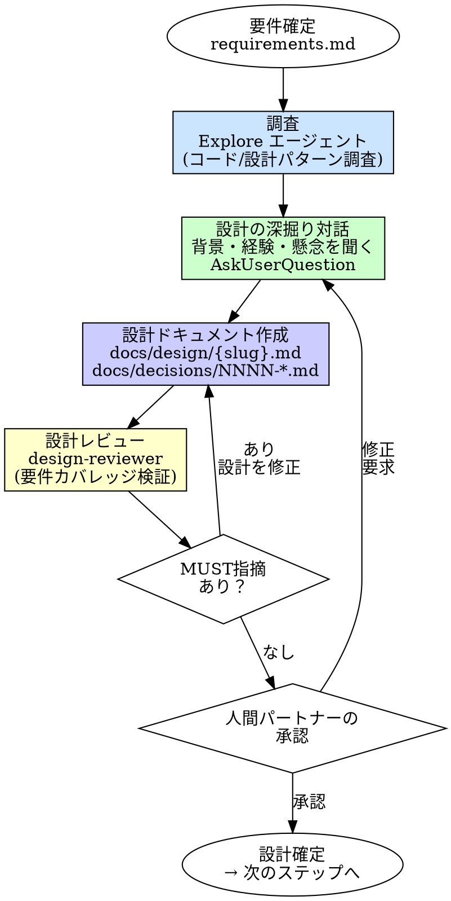

# Design（設計）

## 概要

要件が確定した後、コードを書く前に設計を対話で固める。
人間パートナーとの対話を通じて設計の選択肢を検討し、合意した設計を design.md にまとめる。

**入力:** REQ パス（例: `requirements/REQ-001/`）+ 承認済みの `requirements.md` 全文
**出力:** `docs/design/{slug}.md`（設計の SSOT）+ `docs/decisions/NNNN-*.md`（ADR）

**原則:** 要件が「何を作るか」を決めるなら、設計は「どう作るか」を決める。設計なしの実装は、地図なしで家を建てるようなものだ。

## Iron Law

```
設計承認なしにコードを書くな
```

「要件があるから設計は不要」→ 要件は振る舞いを定義する。設計は構造を定義する。別の話だ。

- 「頭の中で設計はできている」→ 頭の中の設計は実装開始の30分後に崩れる
- 「小さい機能だから設計不要」→ 小さい機能でもアーキテクチャへの影響はある
- 「実装しながら設計する」→ 手戻りが発生する。設計を先に固めろ

## 位置づけ

| スキル | 問い | 対話の性質 |
|--------|------|----------|
| requirements | What + Why（何を作るか） | スコープ・受入条件を詰める |
| **design** | **How（どう作るか）** | **設計の背景・経験・懸念を深掘りし、一緒に設計を決める** |
| planning | When/Order（いつ・どの順で） | タスク分解（対話少。分解の承認のみ） |

## いつ使うか

**常に:**
- 新機能の実装前
- アーキテクチャに影響する変更

**例外（人間パートナーに確認すること）:**
- 既存パターンの機械的な適用（CRUD 追加等）
- 修正箇所が特定済みのバグ修正

## 役割分担（重要）

| 担当 | 責務 | できること |
|------|------|----------|
| メインセッション（あなた） | 対話・評価・意思決定 | AskUserQuestion、判断、design.md 作成 |
| Explore エージェント | コードベース/ドキュメント調査 | Read, Grep, Glob（調査のみ） |
| design-reviewer（サブエージェント） | 設計の検証 | 要件カバレッジチェック（Read only） |

**鉄則: 対話はサブエージェントに委譲するな。対話はメインセッションの責務だ。**

## プロセス



### Phase 1: 調査（Explore エージェント）

Explore エージェントにコードベース・ドキュメントの調査を委譲する。

調査対象:
- 既存のコード構造（モジュール分割、レイヤー設計）
- 既存の設計ドキュメント・ADR
- 採用している技術パターン（DI、Repository パターン等）
- 要件の実現に関連する既存コンポーネント
- 技術的制約（依存ライブラリ、フレームワークの制約）

調査結果から「既に決まっていること」「まだ決まっていないこと」「設計の選択肢」を整理する。

### Phase 2: 対話（設計の深掘り）— ★最も重要★

AskUserQuestion でユーザーと対話しながら設計を詰める。

**対話の進め方:**
- まず背景を聞く: 「この設計で重視していることは？」「過去の経験から避けたい設計パターンはある？」「懸念は何か？」
- 設計の論点ごとに選択肢を提示し、一緒に検討する
- 選択肢にはトレードオフを含める（全部正解にしない）
- 一度に 1-2 問。回答を見て次の問いを調整する
- 合意に至るまで対話を続ける

**やってはいけないこと:**
- 推薦して Yes/No を聞くだけ（「Aがいいですが、いいですか？」）→ これは対話ではない
- 一度に大量の質問を投げる
- 専門用語を説明なしに使う
- ユーザーの直感や経験を否定する
- 推測で設計を決める

**設計の論点（参考）:**

| 論点 | 質問例 |
|------|--------|
| **アーキテクチャ** | どのような責務の分割を考えている？テストしやすさとシンプルさのどちらを優先する？ |
| **データモデル** | このデータはどこに持つべきか？変更頻度は？ |
| **依存関係** | 既存のどのモジュールと連携する？外部サービスへの依存はどう扱う？ |
| **エラーハンドリング** | エラーをどの層で捕捉し、どう伝播させる？ |
| **テスト戦略** | どの層に重点的にテストを置く？外部依存のモックはどこまで許容する？ |

### Phase 3: 設計ドキュメント作成

合意した設計を `docs/design/{slug}.md` に作成する。
設計判断を `docs/decisions/NNNN-*.md` に ADR として記録する。

### Phase 4: レビュー

`design-reviewer` サブエージェントに設計の要件カバレッジを検証させる。

検証の観点:
- 全 FR が設計のいずれかのコンポーネントでカバーされているか
- 設計が requirements.md のスコープ内に収まっているか
- インターフェース設計が AC-* の入出力と整合しているか
- 異常系（IF）のハンドリングが設計に含まれているか

結果の対応:
- MUST 指摘あり → 設計を修正して再レビュー（最大2回）
- MUST 指摘なし → Phase 5 へ

### Phase 5: 承認

人間パートナーに design.md を提示し、承認を得る。
承認後、status を Approved に更新する。
次のステップ（planning or tdd）に進む。

## 出力ファイル構成

```
docs/design/{slug}.md         # 設計の SSOT
docs/decisions/NNNN-*.md      # ADR（設計判断ごとに1ファイル）
```

ADR が不要なケース: 設計上の選択肢が1つしかなく、判断の記録が不要な場合。

## design.md テンプレート

```markdown
---
status: Draft | Approved
owner: [担当者]
last_updated: YYYY-MM-DD
covers: [REQ-001, REQ-002 等]
---

# <タイトル>

## 設計概要
[選択した設計アプローチの要約。1-3文]

## アーキテクチャ
[モジュール構成、レイヤー分割、依存方向]

## ディレクトリ構造
[具体的なファイル配置]

## インターフェース設計
[API、関数シグネチャ、データ構造]

## 設計判断
[各判断は docs/decisions/ の ADR を参照]

| 判断 | ADR | 選択 | 理由 |
|------|-----|------|------|
| [何を決めたか] | [ADR-NNNN] | [選んだもの] | [なぜ] |

## 影響範囲
- 変更対象
- 新規作成
- 依存する既存コード

## 未解決事項（あれば）
```

## ADR テンプレート（docs/decisions/NNNN-*.md）

```markdown
# NNNN: <判断のタイトル>

- **Status**: Accepted | Superseded | Deprecated
- **Date**: YYYY-MM-DD
- **Covers**: [REQ-001 等]

## 背景

[なぜこの判断が必要だったか。解決しようとした問題は何か]

## 選択肢

### 選択肢 A: [名前]
- 概要: [何をするか]
- メリット: [利点]
- デメリット: [欠点・トレードオフ]

### 選択肢 B: [名前]
- 概要: [何をするか]
- メリット: [利点]
- デメリット: [欠点・トレードオフ]

## 決定

[選択した選択肢と理由]

## 結果

[この決定によって生じる影響・制約]
```

## よくある合理化

| 言い訳 | 現実 |
|--------|------|
| 「要件を見れば設計は自明」 | 自明に見える設計ほど実装で崩れる |
| 「実装しながら設計する」 | 設計の手戻りは実装の手戻りより高い |
| 「ドキュメントを書く時間がない」 | 設計ドキュメントを読む時間は実装の何倍も速い |
| 「この程度の機能に設計は大げさ」 | 小さい機能でも隣接するコードへの影響がある |
| 「承認なしに始める」 | 承認なしの設計で実装を始めると、方向性の不一致が後半で露出する |

## 危険信号

以下のどれかに当てはまったら、**設計に戻れ。**

- [ ] 「どう作るか」を1文で説明できない
- [ ] インターフェース（入出力・関数シグネチャ）が未定義
- [ ] 責務の境界が曖昧（どの層がどの処理をするか不明）
- [ ] 設計判断の根拠がない（なぜその構造を選んだか不明）
- [ ] 要件の全 FR が設計に対応していない
- [ ] 人間パートナーの承認を得ていない

## 検証チェックリスト

設計確定前に確認:

- [ ] 全 FR が設計のいずれかのコンポーネントでカバーされている
- [ ] インターフェース設計が AC-* の入出力と整合している
- [ ] 設計がスコープ（やらないこと）を超えていない
- [ ] 異常系（IF）のハンドリングが設計に含まれている
- [ ] 設計判断が ADR として記録されている
- [ ] 人間パートナーの承認を得ている（status: Approved）

## 行き詰まった場合

| 問題 | 解決策 |
|------|--------|
| 設計の選択肢が出てこない | Explore エージェントに既存パターンの調査を委譲 |
| トレードオフが判断できない | 「重視している観点（テスト容易性/シンプルさ/拡張性）」を人間に聞く |
| 設計が大きくなりすぎる | REQ を分割する。1つの design.md = 1つの REQ |
| レビューで MUST 指摘が繰り返される | 設計の根本的な方向性を見直す。Phase 2 に戻って対話する |

## 委譲指示

あなたはこのスキルの対話プロセスを自分で実行する。ただし調査とレビューは委譲する。

**前提: 対応する REQ を特定する。** ディスパッチ前に、このタスクに対応する `requirements/REQ-*/requirements.md` を特定しろ。タスクのコンテキスト（直前のステップの出力）に REQ パスが含まれていればそれを使う。見つからなければ `requirements/` を確認し、候補を人間パートナーに AskUserQuestion で提示して選択してもらう。**推測で REQ を決めるな。必ず人間に確認しろ。**

1. **`explore` エージェントをディスパッチしてコードベースを調査する**
   - プロンプトに REQ パス + requirements.md の概要 + 調査観点（既存の設計パターン、関連モジュール等）を含める
   - `explore` は既存コード・ドキュメントの構造を報告する（Read, Grep, Glob のみ）

2. **調査結果を整理し、設計の論点を特定する**
   - 「既に決まっていること」「まだ決まっていないこと」「設計の選択肢」を整理する
   - 論点ごとに選択肢とトレードオフを準備する

3. **AskUserQuestion で対話を行い、設計を合意する**
   - まず背景・経験・懸念を聞く
   - 論点ごとに選択肢を提示して一緒に検討する
   - 一度に 1-2 問。回答を踏まえて次の問いを調整する
   - 合意に至るまで対話を続ける

4. **design.md と ADR を作成する**
   - 合意した設計を `docs/design/{slug}.md` にまとめる
   - 設計判断（選択肢があった箇所）を `docs/decisions/NNNN-*.md` に ADR として記録する
   - NNNN は既存 ADR の最大番号 + 1（`docs/decisions/` を確認して採番）

5. **`design-reviewer` エージェントをディスパッチして設計をレビューする**
   - プロンプトに REQ パス + design.md 全文 + requirements.md 全文を含める
   - **コンテキストはプロンプトに全文埋め込む。** エージェントにファイルを読ませるな
   - `design-reviewer` は要件カバレッジ・スコープ整合性・インターフェース整合性を検証する

6. **レビュー結果に対応する**
   - MUST 指摘あり → 設計を修正して再レビュー（最大2回）
   - MUST 指摘なし → 人間パートナーに最終承認を依頼する

7. **承認後、次のステップに進む**
   - 複数タスクに分解が必要 → planning へ
   - 1タスクで完結する → tdd へ

## Integration

**前提スキル:**
- **requirements** — 承認済みの requirements.md が存在すること（必須）

**必須ルール:**
- **docs-structure** — 出力ファイルの配置・命名規則

**出力:**
- `docs/design/{slug}.md` — 設計の SSOT
- `docs/decisions/NNNN-*.md` — ADR（設計判断がある場合）

**次のステップ:**
- **planning** — タスク分解が必要な場合
- **tdd** — 1タスクで完結する場合

**このスキルの出力を参照するエージェント:**
- **planner** — design.md のアーキテクチャ・コンポーネント構成を参照してタスク分解する
- **implementer** — design.md のインターフェース設計・ディレクトリ構造を実装の基準にする
- **spec-compliance-reviewer** — design.md と requirements.md の整合性を照合する
- **docs-integrity-reviewer** — design.md と ADR の整合性を検証する
