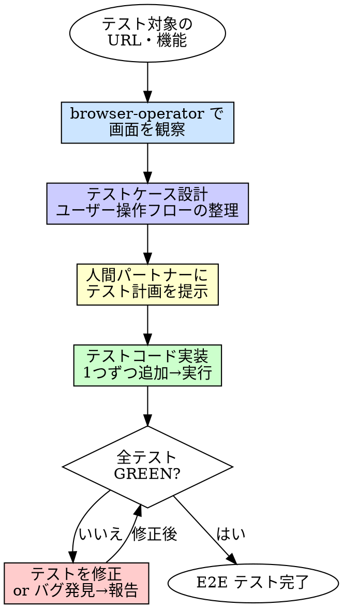

# E2E Test（E2E テスト作成）

## 概要

browser-operator でアプリケーションを実際にブラウザで操作・観察し、その情報をもとに Playwright Test の E2E テストコードを設計・実装する。

**入力:** テスト対象の URL + 確認したい画面・機能の指示
**出力:** Playwright Test の E2E テストコード（テスト全 GREEN）

**原則:** 画面を実際に見てからテストを書く。推測でテストを書かない。

## Iron Law

```
画面を見ずに E2E テストを書くな
```

- 「仕様書だけ見てテストを書く」→ 実際の画面と乖離したテストになる
- 「セレクタを推測する」→ 要素が見つからず壊れるテストになる
- 「ハッピーパスだけ書く」→ ユーザーが実際に踏むエラーパスが漏れる

## いつ使うか

- 新しい画面・機能の E2E テストを作成するとき
- 既存機能に E2E テストを追加するとき
- 手動テストを自動化するとき

## プロセス



### 1. 画面の観察

`browser-operator` に対象 URL を渡して、画面の状態を把握する。

| 確認事項 | 観点 |
|---------|------|
| 画面構成 | どんな要素があるか（フォーム、ボタン、リスト等） |
| ユーザー操作フロー | どういう順序で操作するか |
| 画面遷移 | 操作後にどこに遷移するか |
| エラー表示 | 不正な操作をしたときに何が表示されるか |
| ローディング | 非同期処理の待ち時間があるか |

### 2. テストケース設計

観察結果に基づき、E2E テストケースを設計する。

#### テストケースの分類

| 分類 | 説明 | 例 |
|------|------|----|
| **ハッピーパス** | 正常なユーザー操作フロー | フォーム入力 → 送信 → 成功メッセージ表示 |
| **バリデーション** | 入力バリデーションの検証 | 必須項目未入力 → エラーメッセージ表示 |
| **画面遷移** | ページ間の遷移が正しいか | リンク押下 → 正しいページに遷移 |
| **状態変化** | 操作後の UI 状態変化 | 項目追加 → リストに反映 |
| **エッジケース** | 特殊な操作パターン | 連打、戻るボタン、リロード |

#### テストケース設計のフォーマット

```
## E2E テストケース

### ハッピーパス
- E2E-1: [ログインフォームに有効な認証情報を入力して送信すると、ダッシュボードに遷移する]

### バリデーション
- E2E-2: [メールアドレスを空のまま送信すると、エラーメッセージが表示される]

### 画面遷移
- E2E-3: [ナビゲーションの「設定」リンクを押すと、設定ページに遷移する]
```

### 3. 人間パートナーにテスト計画を提示

設計したテストケース一覧を人間パートナーに提示し、承認を得る。

- テストケースが多い場合、優先度をつけて提示する
- 人間パートナーの判断でテストケースを追加・除外する

### 4. テストコード実装

承認されたテストケースを Playwright Test のコードとして実装する。

- **1つずつ**: テストを1つ追加 → 実行を繰り返す
- **セレクタの選定**: browser-operator の観察結果（アクセシビリティスナップショット）をもとに、安定したセレクタを選ぶ
  - 優先: `getByRole`, `getByText`, `getByLabel`, `getByTestId`
  - 避ける: CSS セレクタ、XPath（壊れやすい）
- **待機処理**: `waitForSelector` や `expect(...).toBeVisible()` を適切に使う。固定の `sleep` は使わない
- **テストが RED になった場合**:
  - **テストが間違っている**: browser-operator で再度画面を確認してテストを修正する
  - **バグを発見した**: バグとして報告する

## 危険信号

以下のどれかに当てはまったら、**やり方を見直せ。**

- [ ] 画面を観察せずにテストを書いた
- [ ] セレクタを推測して書いた（browser-operator で確認していない）
- [ ] テストケースを設計せずにいきなり実装した
- [ ] 固定の `sleep` で待機している
- [ ] CSS セレクタや XPath に依存している
- [ ] 実装コードを修正した（E2E テスト作成の責務ではない）

## 委譲指示

あなたはこのスキルのプロセスを自分で実行しない。以下のエージェントにディスパッチする。

1. **`browser-operator` エージェントをディスパッチして画面を観察**
   - 対象 URL と確認したい画面・機能を指示する
   - 画面構成・操作フロー・遷移・エラー表示の情報を受け取る

2. **テストケースを設計し、人間パートナーに提示**
   - browser-operator の報告をもとにテストケースを設計する
   - 人間パートナーの承認を得る

3. **`implementer` エージェントをディスパッチしてテストコードを実装**
   - プロンプトに browser-operator の観察結果 + 承認済みテストケース + テスト配置先のパス規約を含める
   - **コンテキストはプロンプトに全文埋め込む。** エージェントにファイルを読ませるな
   - implementer が Playwright Test のテストコードを1つずつ実装・実行する

4. **`test-runner` エージェントをディスパッチして最終確認**
   - テストスイート全体を実行して全テスト通ることを確認する

5. **あなたが結果を判断する**
   - 全テスト GREEN → 完了
   - RED のテストがある → browser-operator で再確認し、テスト修正 or バグ報告

## Integration

**前提スキル:**
- なし（独立して使用可能）

**必須ルール:**
- **testing** — テストルール（常時適用）

**前提モジュール:**
- **playwright-mcp** — Playwright MCP モジュールが導入されていること

**このスキルを使うスキル:**
- **test-quality** — E2E テストの品質強化時に参照される可能性がある
- **verification** — 完了検証時に E2E テストを実行する場合
