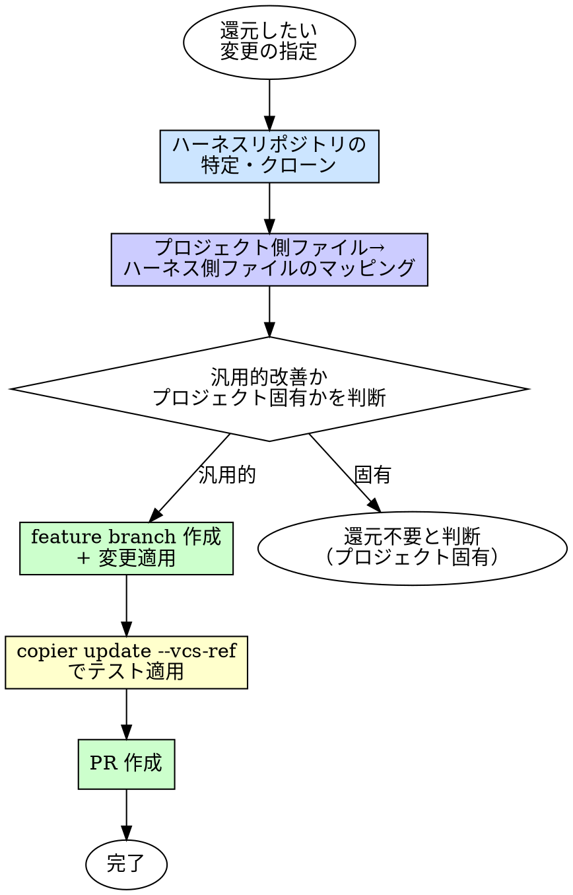

# Harness Contribute（ハーネスへの改善還元）

## 概要

プロジェクト側で行った改善（ルール修正、エージェント改善、スキル追加等）をハーネスリポジトリに自動で還元する。

**入力:** 還元したいファイルパスまたは変更内容の説明
**出力:** ハーネスリポジトリへの PR

## いつ使うか

- 振り返り（retrospective）で「この改善は他プロジェクトでも使える」と判断したとき
- ルールやスキルを改善して、ハーネスに反映したいとき
- 新しいルールやエージェントを作って、ハーネスに追加したいとき

## プロセス



### 1. ハーネスリポジトリの特定

`.copier-answers.yml` からハーネスリポジトリの情報を読み取る。

```yaml
# .copier-answers.yml の _src_path がハーネスリポジトリ
_src_path: gh:sizukutamago/claude-code-harness
```

ローカルにクローンがあるか確認する。なければユーザーにパスを聞く。

### 2. ファイルマッピング

プロジェクト側のファイルパスをハーネスリポジトリ内のパスにマッピングする。

| プロジェクト側 | ハーネスリポジトリ側 |
|---|---|
| `.claude/agents/xxx.md` | `.claude/agents/xxx.md` |
| `.claude/skills/xxx/SKILL.md` | `.claude/skills/xxx/SKILL.md` |
| `.claude/rules/xxx.md` | `.claude/rules/xxx.md` |
| `.claude/hooks/xxx` | `.claude/hooks/xxx` |

パスが一致するものはそのまま。プロジェクト固有のファイル（ハーネスに存在しないもの）は新規追加として扱う。

### 3. 汎用性の判断

変更内容を確認し、汎用的改善かプロジェクト固有かを判断する。

**汎用的改善（還元すべき）:**
- バグ修正（テンプレート起因の問題）
- ルールの改善（より良い表現、抜けの補完）
- エージェントの動作改善（プロンプト改善、tools 修正）
- 新しいルールやスキルで複数プロジェクトに有効なもの

**プロジェクト固有（還元しない）:**
- プロジェクト固有の命名規則
- 特定フレームワーク固有のルール
- プロジェクト固有のワークフロー変更

判断に迷ったら人間パートナーに確認する。

### 4. feature branch 作成 + 変更適用

ハーネスリポジトリで作業する。

1. ハーネスリポジトリに移動
2. main から feature branch を作成（`improve/<変更の要約>`）
3. 対応するファイルに変更を適用
4. 条件付きファイル（`.jinja`）の場合は Jinja テンプレート構文を維持する

**注意:** プロジェクト側のファイルをそのままコピーするのではなく、ハーネスのテンプレートとして適切な形に変換する。プロジェクト固有の値がハードコードされていないか確認する。

### 5. テスト適用

元のプロジェクトに戻り、feature branch の変更をテスト適用する。

```bash
cd /path/to/project
copier update --vcs-ref improve/<変更の要約>
```

テスト適用後、変更が意図通りか確認する。問題があればハーネスリポジトリ側を修正。

### 6. PR 作成

テスト適用が OK なら、ハーネスリポジトリで PR を作成する。

PR に含める情報:
- 何を変えたか
- なぜ変えたか（どのプロジェクトで発見した改善か）
- テスト適用の結果

## 検証チェックリスト

- [ ] `.copier-answers.yml` からハーネスリポジトリを特定した
- [ ] プロジェクト側 → ハーネス側のファイルマッピングを確認した
- [ ] 汎用的改善であることを確認した（プロジェクト固有でない）
- [ ] ハーネスリポジトリで feature branch を作成した
- [ ] プロジェクト固有の値がハードコードされていないことを確認した
- [ ] `copier update --vcs-ref` でテスト適用した
- [ ] PR を作成した

## 危険信号

- [ ] プロジェクト固有の値（パス、URL、プロジェクト名等）がハーネスに混入している
- [ ] .jinja ファイルのテンプレート構文を壊した
- [ ] テスト適用せずに PR を作成した
- [ ] ハーネスの main ブランチに直接コミットした

## 委譲指示

**このスキルは委譲しない。** メインセッションが直接実行する。

理由:
- ハーネスリポジトリとプロジェクトリポジトリの2つを行き来する
- 汎用性の判断に人間の確認が必要
- git 操作（branch 作成、PR 作成）はメインセッションが行う

## Integration

**前提スキル:**
- なし（独立して使用可能。retrospective の後に使うことが多い）

**このスキルを使うスキル:**
- **retrospective** — 振り返りで発見した改善の還元時に参照
