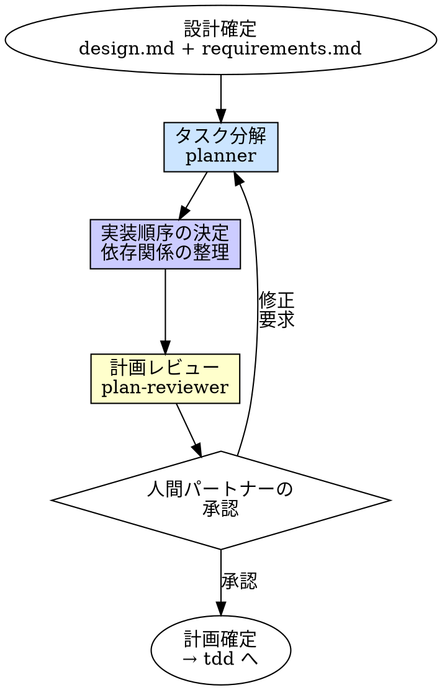

# Planning（計画）

## 概要

設計が確定した後、実装に入る前にタスクを分解する。
何を、どの順序で、どの粒度で実装するかを明確にし、実装の見通しを立てる。

**入力:** REQ パス（例: `requirements/REQ-001/`）+ 承認済みの `design.md` 全文 + `requirements.md` 全文
**出力:** `requirements/REQ-*/plan.md`（承認済み実装計画）

**原則:** 計画なしの実装は、地図なしの登山だ。途中で道を見失ったとき、戻る場所がない。

## Iron Law

```
計画なしに実装を始めるな
```

設計があるから計画は不要？ 設計は「何を作るか」、計画は「どう進めるか」。別の話だ。

- 「頭の中で順序は分かっている」→ 頭の中の順序は2つ目のタスクで破綻する
- 「小さい変更だから計画不要」→ 小さい変更でも依存関係はある
- 「計画を書く時間がもったいない」→ 手戻りの時間の方がもったいない
- 「アジャイルだから計画は立てない」→ アジャイルでもスプリント計画は立てる

タスクサイズによらず計画を行う。タスクが小さければタスク数が少なくなるだけで、プロセスは同じ。

## いつ使うか

**常に:**
- 設計（brainstorming）完了後
- 複数ファイルにまたがる実装
- 依存関係のあるタスク群

**例外（人間パートナーに確認すること）:**
- 1ファイル・1関数の変更で依存がない場合
- バグ修正で修正箇所が特定済みの場合

## プロセス



### 1. タスク分解

`planner` に設計を分解させる。

分解の原則:
- **1タスク = 1つの TDD サイクルで完結する粒度**: テストを書く → 実装する → GREEN にする、が1タスク内で完結すること
- **依存関係を明示**: タスク間の前後関係を明確にする
- **並列可能なタスクを識別**: 依存がないタスクは並列実行できる

### 2. 実装順序の決定

planner の報告をもとに、実装順序を確定する。

順序決定の基準:

| 基準 | 内容 |
|------|------|
| **依存関係** | 依存される側（型定義、interface、共通関数）を先に |
| **リスク順** | 技術的に不確実な部分を先に。後半で詰まるのを防ぐ |
| **価値順** | コア機能を先に。補助機能は後から |
| **テスト容易性** | 外部依存が少ないタスクを先に。テスト環境を段階的に構築 |

### 3. 計画レビュー

`plan-reviewer` に計画を検証させる。

検証の観点:
- タスク分解が設計の全コンポーネントをカバーしているか
- 依存関係に矛盾がないか（循環依存、順序の逆転）
- 各タスクが TDD サイクルで完結する粒度か
- 全 FR がいずれかのタスクでカバーされているか

### 4. 人間パートナーの承認

計画を人間パートナーに提示し、承認を得る。

## 出力ファイル構成

対応する REQ ディレクトリ内に計画ドキュメントを作成する:

```
requirements/REQ-001-user-register/
  requirements.md   # （既存）
  context.md        # （既存）
  design.md         # （既存）
  plan.md           # ★実装計画
```

## plan.md テンプレート

```markdown
---
status: Draft | Approved
owner: [担当者]
last_updated: YYYY-MM-DD
---

# REQ-001: <タイトル> — 実装計画

## 計画概要
[タスク数、推定工数の概要。1-2文]

## タスク一覧

### Task-1: [タスク名]
- **やること**: [このタスクで実装する内容]
- **対応FR**: [FR-1, FR-2 等]
- **依存**: [なし / Task-x が完了していること]
- **成果物**: [作成・変更するファイル]
- **完了条件**: [テストが GREEN になる条件]

### Task-2: [タスク名]
- **やること**: [このタスクで実装する内容]
- **対応FR**: [FR-1 等]
- **依存**: [Task-1]
- **成果物**: [作成・変更するファイル]
- **完了条件**: [テストが GREEN になる条件]

## 依存関係図

[タスク間の依存を示す。テキストで十分]
```
Task-1 → Task-2 → Task-4
              ↘ Task-3 → Task-4
```

## 並列実行可能なタスク
- [Task-2, Task-3] は Task-1 完了後に並列実行可能

## リスク・注意事項
- [技術的に不確実な箇所、外部依存等]
```

## よくある合理化

| 言い訳 | 現実 |
|--------|------|
| 「設計を見れば順序は自明」 | 自明に見える順序で依存関係を見落とす |
| 「計画を立てても変わる」 | 計画は変わっていい。変わった時に元の計画と比較できることが重要 |
| 「1つずつやればいい」 | 全体の見通しなしに1つずつやると、後半で大きな手戻りが発生する |
| 「タスクが小さいから計画不要」 | 小さくても依存関係はある。書く量が少ないだけ |
| 「計画を書く時間で実装できる」 | 計画なしの実装は手戻りで2倍かかる |

## 危険信号

以下のどれかに当てはまったら、**計画を見直せ。**

- [ ] タスクが1つしかない（分解できていない可能性）
- [ ] 全タスクが直列（並列可能なタスクを見落としている可能性）
- [ ] 1タスクの完了条件が曖昧
- [ ] 依存関係が整理されていない
- [ ] 設計の全コンポーネントがタスクでカバーされていない
- [ ] 人間パートナーの承認を得ていない

## 例: ユーザー登録 API の計画

**design.md より:**
- 3層分離: routes/users.ts → services/userService.ts → repositories/userRepository.ts

**plan.md:**
```markdown
---
status: Approved
owner: sizukutamago
last_updated: 2026-04-01
---

# REQ-001: ユーザー登録 API — 実装計画

## 計画概要
3タスクで実装。依存関係は repository → service → route の順。

## タスク一覧

### Task-1: userRepository の実装
- やること: DB アクセス層（create, findByEmail）
- 対応FR: FR-1（データ保存部分）
- 依存: なし
- 成果物: repositories/userRepository.ts, repositories/__tests__/userRepository.test.ts
- 完了条件: create と findByEmail のテストが GREEN

### Task-2: userService の実装
- やること: ビジネスロジック層（パスワードハッシュ化、重複チェック、ユーザー作成）
- 対応FR: FR-1（ロジック部分）
- 依存: Task-1
- 成果物: services/userService.ts, services/__tests__/userService.test.ts
- 完了条件: 正常系・重複エラー・パスワードハッシュ化のテストが GREEN

### Task-3: users route の実装
- やること: ルーティング + バリデーション + 統合テスト
- 対応FR: FR-1（API エンドポイント）
- 依存: Task-2
- 成果物: routes/users.ts, routes/__tests__/users.test.ts
- 完了条件: AC-1〜AC-4 の統合テストが GREEN

## 依存関係図
Task-1 → Task-2 → Task-3

## 並列実行可能なタスク
なし（直列依存）

## リスク・注意事項
- bcrypt のテストは実行時間が長い。テスト用に rounds を下げる
```

## 検証チェックリスト

計画確定前に確認:

- [ ] 設計の全コンポーネントがタスクでカバーされている
- [ ] 各タスクに対応 FR が紐づいている
- [ ] 依存関係に矛盾がない（循環なし）
- [ ] 各タスクが TDD サイクルで完結する粒度
- [ ] 各タスクの完了条件が明確
- [ ] 並列可能なタスクが識別されている
- [ ] 人間パートナーの承認を得ている

## 行き詰まった場合

| 問題 | 解決策 |
|------|--------|
| タスクの粒度がわからない | 「テストを書いて実装して GREEN にする」が1セッションで終わる粒度 |
| 依存関係が複雑すぎる | 設計に問題がある可能性。brainstorming に戻って設計を簡素化 |
| 全タスクが直列になる | 共通の interface/型を先に定義して、実装を並列にできないか検討 |
| タスク数が多すぎる | 関連するタスクをグループ化。ただし1タスク=1TDDサイクルは崩さない |
| 計画通りに進まない | 計画を更新しろ。計画は固定ではない。ただし変更理由を記録する |

## 委譲指示

あなたはこのスキルの順序決定・承認プロセスを自分で実行する。ただし分解とレビューは委譲する。

**前提: 対応する REQ を特定する。** ディスパッチ前に、このタスクに対応する `requirements/REQ-*/requirements.md` と `design.md` を特定しろ。タスクのコンテキスト（直前のステップの出力）に REQ パスが含まれていればそれを使う。見つからなければ `requirements/` を確認し、候補を人間パートナーに AskUserQuestion で提示して選択してもらう。**推測で REQ を決めるな。必ず人間に確認しろ。**

1. **`planner` エージェントをディスパッチしてタスク分解する**
   - プロンプトに REQ パス + 対応する REQ の requirements.md 全文 + design.md 全文を含める
   - **コンテキストはプロンプトに全文埋め込む。** エージェントにファイルを読ませるな
   - `planner` はタスク一覧 + 依存関係 + 実装順序を報告する

2. **あなたが実装順序を確認し、plan.md を作成する**
   - planner の報告をもとに plan.md テンプレートに従って構造化する
   - 依存関係・並列可能タスク・リスクを整理する
   - `requirements/REQ-*/plan.md` に出力する

3. **`plan-reviewer` エージェントをディスパッチして計画をレビューする**
   - プロンプトに REQ パス + plan.md 全文 + design.md 全文 + requirements.md 全文を含める
   - **コンテキストはプロンプトに全文埋め込む。** エージェントにファイルを読ませるな
   - `plan-reviewer` はタスクカバレッジ・依存関係の整合性・粒度を検証する

4. **レビュー結果に対応する**
   - MUST 指摘あり → 計画を修正して再レビュー（最大2回）
   - MUST 指摘なし → 人間パートナーに最終承認を依頼する

5. **承認後、tdd スキルに進む**
   - plan.md の Task-1 から順に tdd スキルで実装を開始する

## Integration

**前提スキル:**
- **brainstorming** — 承認済みの design.md が存在すること
- **requirements** — 承認済みの requirements.md が存在すること
- **roadmap**（大規模時のみ）— 複数フェーズの場合、roadmap.md で各フェーズの scope が定義済みであること

**必須ルール:**
- **docs-structure** — 計画ドキュメントの配置・命名規則

**次のステップ:**
- **tdd** — タスク順に TDD サイクルで実装する

**このスキルの出力を参照するエージェント:**
- **implementer** — タスクの「やること」「完了条件」を実装の基準にする
- **spec-compliance-reviewer** — タスクと FR の対応を確認する
