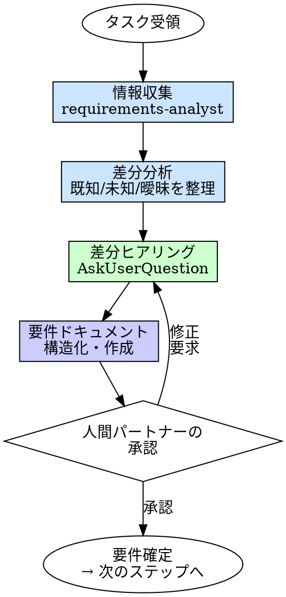

# Requirements（要件理解）

## 概要

実装の前に、何を作るか・なぜ作るかを構造化する。
人間パートナーとの対話を通じて曖昧さを除去し、全員（人間・AI）が参照できる要件ドキュメントを作る。

**入力:** 人間パートナーからのタスク指示
**出力:** `requirements/REQ-*/requirements.md` + `context.md`（+ 必要に応じて `decisions.md`）

**原則:** 曖昧な要件から始めた実装は、曖昧な結果を生む。

## Iron Law

```
構造化された要件なしに設計を始めるな
```

要件が頭の中にある？ それはまだ要件ではない。書け。

- 「自明だから要件定義は不要」→ 自明に見える要件に限って解釈が割れる
- 「口頭で合意した」→ 口頭の合意は1時間で蒸発する
- 「要件は実装しながら固める」→ 固まらない。スコープが膨張する

タスクサイズによらず要件定義を行う。タスクが小さければ書く量が少なくなるだけで、プロセスは同じ。

## いつ使うか

**常に:**
- 新機能の開発
- 複数ファイルにまたがるバグ修正
- 仕様変更・機能拡張

**例外（人間パートナーに確認すること）:**
- typo 修正
- 自動生成コードの更新

## プロセス



### 1. 情報収集

`requirements-analyst` にコードベース・ドキュメントの調査を委譲する。

調査対象:
- 関連する既存コード・モジュール
- 既存の仕様書・ADR・要件ドキュメント
- 技術的制約（依存関係、互換性要件）
- 関連テストの存在と網羅度

### 2. 差分分析

調査結果から、以下を整理する:
- **既知**: 既存資料から確定している事実
- **未知**: 情報が存在しない部分
- **曖昧**: 情報はあるが解釈が割れる部分

この整理が次の差分ヒアリングの質問を決める。**テンプレ質問を機械的に全部聞くな。不足している論点だけ質問を生成しろ。**

### 3. 差分ヒアリング

AskUserQuestion を使い、不足部分だけを段階的に質問する。

**質問の原則:**
- **選択肢ベース優先**: 2-4個の選択肢を提示。自由記述は「その他」で補う
- **一度に3問以内**: 大量の質問で人間を圧倒しない
- **段階的に聞く**: 回答を見て追加質問する。全部まとめて聞かない
- **推測を述べて確認する**: 「Xだと思いますが合っていますか？」の形式を優先

**ヒアリング観点:**

| 観点 | 質問例 |
|------|--------|
| **目的** | この機能は誰のどんな問題を解決する？ |
| **スコープ** | 今回やること・やらないことの境界は？やらない理由は？ |
| **振る舞い** | 正常系はどう動く？異常系は？ |
| **入出力** | 入力は何？出力は何？型は？ |
| **前提・制約** | 既存API互換は必要？依存サービスは？ |
| **受け入れ条件** | 何が確認できたら「完了」と言える？ |

**ヒアリング記録**: 質問と回答は context.md に記録する（フォーマットは後述）。

### 4. 要件ドキュメントの構造化

対話で得た情報を要件ドキュメントにまとめる。確定した事実だけを requirements.md に、背景・経緯を context.md に分離する。

### 5. 人間パートナーの承認

要件ドキュメントを人間パートナーに提示し、承認を得る。
修正要求があれば対話に戻る。

## 出力ファイル構成

REQ ごとにディレクトリを作成する:

```
requirements/REQ-001-user-register/
  requirements.md   # 正本。下流はこれだけ読む
  context.md        # 背景、ヒアリング記録、前提・仮説
  decisions.md      # 任意。除外判断や代替案の検討があるときだけ
```

| ファイル | 中身 | 読む人 |
|---------|------|--------|
| `requirements.md` | 承認済みの事実（FR, AC, NFR, スコープ） | spec-compliance-reviewer, implementer, verifier |
| `context.md` | 背景、ヒアリング記録、前提・仮説 | 人間（振り返り・トレーサビリティ） |
| `decisions.md` | スコープ外判断、代替案、再検討条件 | 人間（判断の追跡）。除外判断があるときのみ |

## requirements.md テンプレート

```markdown
---
status: Draft | Approved
owner: [担当者]
last_updated: YYYY-MM-DD
---

# REQ-001: <タイトル>

## 概要
[1-2文でタスクの目的を記述]

## ユーザー価値
- **対象ユーザー**: [誰が使うか]
- **達成したいこと**: [何をしたいか]
- **期待する価値**: [それによって何が得られるか]

## スコープ
### やること
- [具体的な変更内容1]
- [具体的な変更内容2]

### やらないこと
- [除外する内容1] — 理由: [なぜやらないか]
- [除外する内容2] — 理由: [なぜやらないか]

## 前提・制約
- [既存API互換、依存サービス、既存データ前提など]

## 機能要件

### FR-1: <機能名>
- **振る舞い**:
  - WHEN [トリガー条件] のとき、システムは [動作] しなければならない。
- **入力**: [入力の型・形式]
- **出力**: [出力の型・形式]
- **異常系**:
  - IF [異常条件1] の場合、システムは [エラー動作1] を返さなければならない。
  - IF [異常条件2] の場合、システムは [エラー動作2] を返さなければならない。

### FR-2: <機能名>
...

## 非機能要件（該当する場合のみ）
- **パフォーマンス**: [応答時間、スループット等]
- **互換性**: [後方互換の要件]
- **セキュリティ**: [認証・認可の要件]

## 受け入れ条件

### AC-1: <検証シナリオの要約>
Covers: FR-1
Given [前提条件]
When [操作]
Then [期待結果]

### AC-2: <検証シナリオの要約>
Covers: FR-1
Given [前提条件]
When [操作]
Then [期待結果]

## 影響範囲
- **変更対象ファイル**: [既知の場合]
- **依存する既存機能**: [影響を受ける機能]

## 未解決事項（あれば）
- [ ] [まだ決まっていないこと]
```

## context.md テンプレート

```markdown
# REQ-001: <タイトル> — コンテキスト

## 背景・動機
[なぜこの変更が必要か。ビジネス的な経緯]

## 調査結果
[requirements-analyst の報告要約]

## ヒアリング記録

### Q1: [質問内容]
- **カテゴリ**: [目的/スコープ/振る舞い/入出力/制約/受け入れ条件]
- **背景**: [なぜこの質問をしたか]
- **回答**: [人間パートナーの回答]
- **要件への反映**: [この回答がどのFR/AC/スコープに反映されたか]

### Q2: [質問内容]
...

## 前提・仮説（未確認）
- [確認できていない前提1] — 確認方法: [どう確認するか]
- [確認できていない前提2] — 確認方法: [どう確認するか]

## 関連資料
- [参照した既存ドキュメントへのリンク]
```

## decisions.md テンプレート（除外判断があるときのみ）

```markdown
# REQ-001: <タイトル> — スコープ判断

## Scope Decisions

| ID | Item | Decision | Reason | Basis | Revisit Trigger |
|----|------|----------|--------|-------|-----------------|
| SD-1 | [除外項目] | Out of Scope | [なぜやらないか] | [判断根拠・合意日] | [再検討する条件] |
| SD-2 | [採用項目] | In Scope | [なぜやるか] | [判断根拠] | - |

## 代替案の検討（あれば）

### [検討した代替案]
- **概要**: [何を検討したか]
- **不採用理由**: [なぜ採用しなかったか]
```

### フォーマットの設計意図

| セクション | 参照する下流 | 理由 |
|-----------|------------|------|
| **FR-*（WHEN/IF記法）** | spec-compliance-reviewer | 曖昧さのない照合基準 |
| **AC-*（Given/When/Then）** | implementer, verifier | TDDテスト構造に直接対応 |
| **AC の Covers: FR-x** | spec-compliance-reviewer, verifier | FR と AC の機械的な追跡 |
| **スコープ（やらないこと+理由）** | spec-compliance-reviewer | スコープ逸脱の検出 + 判断の追跡 |
| **前提・制約** | implementer | 仕様が立つ土台の明示 |
| **ユーザー価値** | spec-compliance-reviewer | 「誰の何の価値か」の検証 |
| **ヒアリング記録（context.md）** | 人間 | 判断経緯のトレーサビリティ |
| **Scope Decisions（decisions.md）** | 人間 | 除外理由と再検討条件の追跡 |

## よくある合理化

| 言い訳 | 現実 |
|--------|------|
| 「要件は自明だ」 | 自明に見える要件こそ、人によって解釈が割れる |
| 「実装しながら固める」 | スコープが際限なく膨張する。事前に境界を決めろ |
| 「ドキュメントを書く時間がない」 | 手戻りの時間の方がはるかに高い |
| 「口頭で合意した」 | 口頭の合意は蒸発する。書いて初めて合意 |
| 「アジャイルだから要件定義は不要」 | アジャイルでもユーザーストーリーは書く |
| 「小さい変更だから」 | 小さい変更でも経緯は残せ。書く量が少ないだけでスキップする理由にならない |

## 危険信号

以下のどれかに当てはまったら、**要件定義に戻れ。**

- [ ] 「何を作るか」を1文で説明できない
- [ ] 受け入れ条件がない（何をもって完了か不明）
- [ ] スコープの境界が決まっていない（やらないことが不明）
- [ ] 異常系の挙動が未定義
- [ ] 人間パートナーの承認を得ていない
- [ ] 実装中に「これも必要だった」が頻発する

## 例: ユーザー登録 API の要件定義

**人間パートナー:** 「ユーザー登録機能を作って」

**差分ヒアリング:**
```
Q1: 登録に必要なフィールドは？ (選択肢: メール+パスワード / メール+パスワード+表示名 / その他)
A: メール+パスワード+表示名

Q2: メールの重複チェックは必要ですか？
A: はい、エラーを返す

Q3: パスワードの要件は？ (選択肢: 8文字以上 / 8文字以上+記号必須 / カスタム)
A: 8文字以上、それ以外は特になし
```

**requirements.md:**
```markdown
---
status: Approved
owner: sizukutamago
last_updated: 2026-03-31
---

# REQ-001: ユーザー登録 API

## 概要
新規ユーザーをメール・パスワード・表示名で登録する API エンドポイント。

## ユーザー価値
- 対象ユーザー: 新規ユーザー
- 達成したいこと: メールアドレスとパスワードでアカウント登録したい
- 期待する価値: サービスの初回利用を開始できる

## スコープ
### やること
- POST /users エンドポイントの作成
- 入力バリデーション
- パスワードのハッシュ化保存

### やらないこと
- OAuth/ソーシャルログイン — 理由: MVPではメール登録を優先。複数IdP要件が出たら再検討
- メール認証フロー — 理由: 初期リリースでは不要。ユーザー数増加後に追加予定

## 前提・制約
- 既存の Express + PostgreSQL 環境を使用
- bcrypt でパスワードハッシュ化

## 機能要件
### FR-1: ユーザー登録
- **振る舞い**:
  - WHEN クライアントが有効な登録リクエストを POST /users に送信したとき、システムはユーザーを作成し 201 Created を返さなければならない。
- **入力**: { email: string, password: string, displayName: string }
- **出力**: { id: string, email: string, displayName: string }
- **異常系**:
  - IF email が既存ユーザーと重複している場合、システムは 409 Conflict を返さなければならない。
  - IF password が8文字未満の場合、システムは 400 Bad Request を返さなければならない。

## 受け入れ条件

### AC-1: 有効な入力で登録が成功する
Covers: FR-1
Given 未登録のメールアドレスが入力されている
When ユーザーが POST /users に有効なリクエストを送信する
Then 201 が返り、ユーザーが作成される

### AC-2: 重複メールで登録が拒否される
Covers: FR-1
Given 同じメールアドレスのユーザーが既に存在する
When ユーザーが POST /users にそのメールで登録を試みる
Then 409 が返る

### AC-3: 短いパスワードで登録が拒否される
Covers: FR-1
Given パスワードが8文字未満
When ユーザーが POST /users に登録を試みる
Then 400 が返る

### AC-4: パスワードが安全に保存される
Covers: FR-1
Given ユーザーが正常に登録された
When データベースのユーザーレコードを確認する
Then パスワードが平文ではなくハッシュ化されて保存されている
```

## 検証チェックリスト

要件確定前に確認:

- [ ] タスクの目的が1文で説明できる
- [ ] やること・やらないことの境界が明確（やらないことに理由がある）
- [ ] 各 FR に振る舞い（WHEN）・入力・出力・異常系（IF）が定義されている
- [ ] 各 AC が Given/When/Then で書かれ、Covers で FR に紐づいている
- [ ] 前提・制約が明記されている
- [ ] 人間パートナーの承認を得ている（中大タスク）
- [ ] ヒアリング記録が context.md に残っている

## 行き詰まった場合

| 問題 | 解決策 |
|------|--------|
| 人間パートナーが要件を決められない | 選択肢を提示して選んでもらう。「AとBどちらですか？」 |
| 要件が大きすぎる | タスクを分割する。1つの REQ で1つの機能 |
| 技術的な制約がわからない | requirements-analyst にコードベース調査を委譲 |
| 要件が曖昧なまま進みたいと言われた | リスクを伝えた上で、最低限の AC だけでも合意する |
| やらないことの理由が不明確 | decisions.md に Revisit Trigger 付きで記録し、後で再検討可能にする |

## 委譲指示

あなたはこのスキルの対話プロセスを自分で実行する。ただし情報収集は委譲する。

1. **`requirements-analyst` エージェントをディスパッチして情報収集する**
   - 既存コードベース・ドキュメントの調査をディスパッチする
   - プロンプトにタスクの概要 + 調査対象のヒント（ディレクトリ、モジュール名等）を含める
   - `requirements-analyst` は調査結果を構造化して報告する

2. **差分分析を行い、不足する論点を特定する**
   - 調査結果から既知/未知/曖昧を整理する
   - テンプレ質問を全部聞くな。不足している論点だけ質問を組み立てる

3. **差分ヒアリングを AskUserQuestion で実行する**
   - 選択肢ベースの質問を優先する（2-4個の選択肢 + その他）
   - 一度に3問以内。回答を見て追加質問する
   - 推測を述べて確認を求める形式を優先する
   - 質問と回答を context.md のヒアリング記録に記録する

4. **要件ドキュメントを作成する**
   - 確定した事実を requirements.md に構造化する
   - 背景・ヒアリング記録・前提を context.md に記録する
   - 除外判断や代替案の検討があれば decisions.md を追加する
   - `requirements/REQ-<連番>-<slug>/` ディレクトリに出力する

5. **人間パートナーに承認を依頼する**
   - requirements.md を提示し、承認を得る
   - 修正要求があればヒアリングに戻る
   - 承認後、status を Approved に更新する

6. **承認後、次のステップに進む**
   - 設計が必要 → brainstorming へ
   - タスク分解が必要 → planning へ
   - すぐ実装できる → tdd へ

## Integration

**前提スキル:**
- なし（ワークフローの起点）

**必須ルール:**
- **docs-structure** — 出力ファイルの配置・命名規則

**出力:**
- `requirements/REQ-<連番>-<slug>/requirements.md` — 下流の全スキル・エージェントが参照する正本
- `requirements/REQ-<連番>-<slug>/context.md` — 背景・ヒアリング記録・前提
- `requirements/REQ-<連番>-<slug>/decisions.md` — スコープ判断（除外判断があるときのみ）

**次のステップ:**
- **brainstorming** — 設計が必要な場合
- **planning** — タスク分解が必要な場合
- **tdd** — すぐ実装できる場合

**このスキルの出力を参照するエージェント:**
- **spec-compliance-reviewer** — FR-*/AC-*/スコープで実装を照合
- **verifier** — AC-* で完了検証
- **implementer** — 入力/出力/異常系を実装の基準にする
