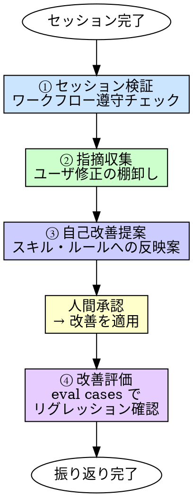

# Retrospective（振り返り）

## 概要

セッションで何が起きたかを振り返り、ハーネスを自己改善する。
感覚ではなく、成果物とユーザ指摘に基づいて改善ループを回す。

**入力:** セッションの成果物（git log、作成ファイル、テスト結果）+ セッション中のユーザ指摘
**出力:** ワークフロー遵守レポート + 自己改善提案 + リグレッション確認結果（変更があった場合）

**原則:** 振り返らないチームは同じ失敗を繰り返す。

## Iron Law

```
振り返りなしにセッションを終えるな
```

「今回はうまくいったから振り返り不要」→ うまくいった理由がわからなければ次も再現できない。

## いつ使うか

**常に:**
- コミット・PR（[11]）が完了した後
- セッション終了時

**トリガー:**
- SessionEnd フックがリマインダーを表示（スキル自体の自動実行ではない）

## プロセス



### ① セッション検証（「ワークフローを守ったか？」）

git log とセッションの成果物から、ワークフロー [1]〜[11] の各ステップを実施したかを確認する。

| ステップ | 確認方法 |
|---------|---------|
| [1] 要件理解 | `requirements/REQ-*/requirements.md` が存在するか |
| [2] 設計 | `docs/design/` に設計書が存在するか |
| [3] 計画 | `docs/plans/` に実装計画が存在するか |
| [4][5] 実装・テスト | テストファイルが存在し、全 GREEN か |
| [6] リファクタ | simplify の実施痕跡（コミット履歴） |
| [7] 品質テスト | TQ-* テストが追加されているか |
| [8] レビュー | 3観点レビューの実施痕跡 |
| [9] 検証 | 検証報告書の存在 |
| [10] 整理 | デバッグコード・一時ファイルが残っていないか |
| [11] コミット | コミットメッセージが適切か |

**例外の扱い:** 人間パートナーが明示的にスキップを承認したステップは「スキップ（承認済み）」として記録する。未承認のスキップだけを問題として報告する。

### ② 指摘収集（「ユーザが何を直したか？」）

`.claude/harness/session-feedback.jsonl` に記録されたフィードバックのうち、`status: open` のものを収集・分類する。

#### フィードバックの記録方式

セッション中のフィードバックは **2つの方式** で自動記録される:

1. **ルールによる自己記録** — ユーザに指摘・修正されたことを Claude 自身が認識し、即座に `.claude/harness/session-feedback.jsonl` に記録する（`feedback-recording ルール（`.claude/rules/` で自動適用）` で規定）
2. **hook による自動検知** — ツール拒否（PreToolUse で deny）、同一ファイルの再編集（PostToolUse で追跡）を自動で記録する（将来実装）

#### フィードバックの形式

```jsonl
{"id":"fb-001","timestamp":"2026-04-01T08:30:00Z","status":"open","type":"correction","category":"scope","summary":"cleanup-agentのスコープにlint除外を追記","user_said":"コード整理はlintの仕事でしょ？","affected":".claude/agents/cleanup-agent.md","session_id":"..."}
```

| フィールド | 説明 |
|-----------|------|
| `id` | フィードバック ID（`fb-XXX`） |
| `status` | `open` → `proposed` → `applied` |
| `type` | `correction`（修正）/ `rejection`（拒否）/ `clarification`（明確化） |
| `category` | `scope`（責務越境）/ `spec`（仕様漏れ）/ `assumption`（前提ミス）/ `design`（過剰設計）/ `naming`（命名） |
| `summary` | 指摘の要約 |
| `user_said` | ユーザの発言（原文） |
| `affected` | 反映先のファイルパス |

#### フィードバックのライフサイクル

```
open       → feedback-collector が収集対象にする
proposed   → improvement-proposer が改善提案を作成済み
applied    → 改善が適用・コミットされた（applied_commit を付与）
```

- `open` のみ retrospective の対象
- `applied` は蓄積し、同じ種別の再発検知に使う
- 溜まりすぎたら `applied` を `.claude/harness/session-feedback-archive.jsonl` にアーカイブ

#### 指摘の種別

| 種別 | 例 |
|------|-----|
| スコープ誤り（`scope`） | 「コード整理は lint の仕事でしょ？」→ 責務の越境 |
| 仕様漏れ（`spec`） | 「REQ の値渡されてる？」→ 入力仕様の欠落 |
| 前提ミス（`assumption`） | 「claude code でやりや」→ 実行環境の前提ミス |
| 設計判断の修正（`design`） | 「それは重すぎる、シンプルにして」→ 過剰設計 |
| 命名の修正（`naming`） | 「eval じゃなくて retrospective にして」→ 命名の不適切 |

### ③ 自己改善提案（「次から自動で守れるようにする」）

収集した指摘を、スキル・ルール・エージェントへの具体的な変更提案に変換する。

```
## 改善提案

### 提案1: cleanup-agent のスコープに lint 除外を明記
- 種別: スコープ誤り
- 指摘: 「コード整理は lint の仕事」
- 反映先: .claude/agents/cleanup-agent.md
- 変更内容: lint/formatter が扱う項目を除外リストに追加
- 根拠: lint で自動矯正できるものは AI が扱わない（coding-style.md 準拠）

### 提案2: 全スキルの入力に REQ パスを明示
- 種別: 仕様漏れ
- 指摘: 「REQ の値渡されてる？」
- 反映先: 全スキル・全エージェントの入力セクション
- 変更内容: REQ パス（例: requirements/REQ-001/）を入力の先頭に追加
```

**人間承認が必要。** 提案を人間パートナーに提示し、承認を得てから適用する。

### ④ 改善評価（「変更で壊れていないか？」）

③ で変更を適用した場合のみ実施する。

- 変更したスキル・ルールに対応する eval cases を `eval/run-eval.mjs` で実行
- 変更前後の遵守率を比較
- リグレッションがあれば報告

## 検証チェックリスト

振り返り完了前に確認:

- [ ] ワークフロー [1]〜[11] の遵守状況を確認した
- [ ] スキップしたステップがあれば、承認済みか未承認かを記録した
- [ ] セッション中のユーザ指摘を全て収集した
- [ ] 指摘を種別・反映先に分類した
- [ ] 改善提案を作成し、人間パートナーに提示した
- [ ] 改善を適用した場合、eval cases でリグレッションを確認した

## 行き詰まった場合

| 問題 | 解決策 |
|------|--------|
| ワークフローのどこまでやったか追えない | git log のコミットメッセージから再構成する |
| ユーザ指摘が多すぎて整理できない | 種別ごとにグループ化し、影響の大きいものから提案する |
| 改善提案が大量になる | 1セッションで3件以内に絞る。残りは次回以降 |
| eval cases が存在しないスキルがある | リグレッション確認はスキップし、eval cases の作成を提案する |

## 委譲指示

あなたはこのスキルのプロセスを自分で実行しない。以下のエージェントに順にディスパッチする。

**前提:** セッションの情報を収集する。ディスパッチ前に以下を取得しろ:
- `git log --oneline`（直近セッション分）
- `git diff --name-only`（変更ファイル一覧）

1. **`session-verifier` エージェントをディスパッチする（① セッション検証）**
   - プロンプトに git log + 変更ファイル一覧を含める
   - セッション中に Claude が Edit/Write したファイルと git diff の差分を突き合わせ、人手修正を検知する
   - 人手修正があれば `type: manual-edit` として `.claude/harness/session-feedback.jsonl` に記録する
   - ワークフロー [1]〜[11] の遵守状況を確認し、遵守レポートを出力する

2. **`scripts/collect-feedback.mjs` を Bash で実行する（② 指摘収集）**
   - `node scripts/collect-feedback.mjs` を実行する
   - スクリプトが決定的処理を行う:
     - `.claude/harness/session-feedback.jsonl` の `status: open` をフィルタ
     - 人手修正（`type: manual-edit`）の判定（Claude が同じファイルを触っていたか）
     - 過去 `applied` との再発チェック（種別 + 反映先の一致）
   - 結果は JSON で stdout に出力される
   - `needs_classification` に含まれるフィードバック（category 未設定）は ③ で LLM が分類する

3. **`improvement-proposer` エージェントをディスパッチする（③ 自己改善提案）**
   - プロンプトに ① の遵守レポート + ② のスクリプト出力（JSON）を含める
   - `needs_classification` のフィードバックがあれば、まず種別を分類する
   - 最大3件の改善提案を作成する
   - **コンテキストはプロンプトに全文埋め込む。** エージェントにファイルを読ませるな

4. **あなたが結果を判断し、人間パートナーに提示する**
   - 遵守レポート + 改善提案を提示し、承認を得る
   - 承認された改善を適用し、フィードバックの status を `applied` に更新する
   - 変更があった場合、④ 改善評価として `eval/run-eval.mjs` を Bash で実行しリグレッションを確認する

4.5. **観察レビュアーのディスパッチ（Phase 2.5 連携）**
   - **条件**: ハーネス定義（`.claude/` 配下）を更新したセッションの場合
   - `harness-user-reviewer` エージェントをディスパッチする
   - プロンプトに以下を含める:
     - `.claude/` 配下の構造（ディレクトリツリー）
     - 直近のセッションで発生したフィードバック（session-feedback.jsonl の open/applied）
   - harness-user-reviewer の finding は observation-log.jsonl に自動追記される

5. **`meta-observer` エージェントをディスパッチする（メタ監視、Phase 4 連携）**
   - **条件**: 直近3セッション以内に meta-observer を実行していない場合のみ。毎セッション実行しない
   - プロンプトに以下を含める:
     - `.claude/harness/observation-points.yaml` の現在内容
     - `.claude/harness/observation-log.jsonl` の直近 50 件
     - `.claude/agents/product-user-reviewer.md` と `.claude/agents/harness-user-reviewer.md` の「観点」セクション
     - `.claude/harness/session-feedback.jsonl` の直近 20 件の category 集計
   - meta-observer の提案を人間パートナーに提示する
   - 承認された提案は observation-points.yaml と対応 L2 エージェントに反映する

## Integration

**前提スキル:**
- **commit** — コミット完了後（通常フロー）
- なしでも実行可（セッション途中の振り返りも可能）

**必須ルール:**
- **feedback-recording** — セッション中のフィードバック記録（データソース）

**次のステップ:**
- **harness-contribute** — 改善をハーネスリポジトリに還元する場合

**トリガー:**
- **SessionEnd フック** — セッション終了時にリマインダーを表示（`.claude/hooks/scripts/session-end-retrospective.mjs`）

**このスキルの出力を参照するもの:**
- **improvement-proposer** エージェント — 改善提案の作成
- 改善提案は次セッション以降のスキル・ルール・エージェントに反映される
- ワークフロー遵守レポートはチームの改善指標として蓄積される
