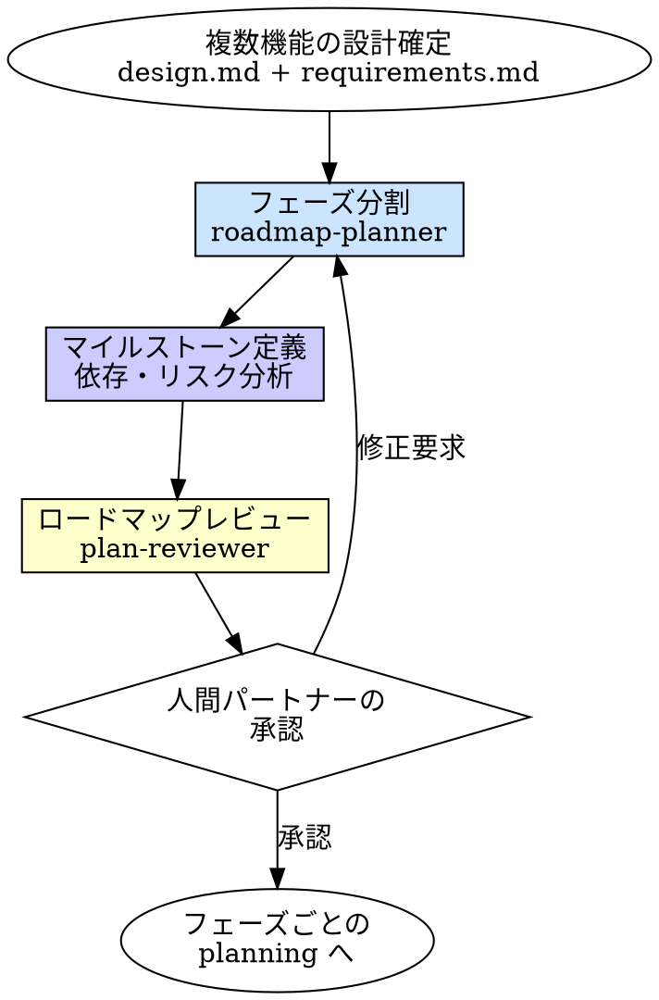

# Roadmap（ロードマップ計画）

## 概要

複数機能にまたがる大規模な変更を、フェーズに分割して管理する。
各フェーズの範囲・マイルストーン・依存関係・リスクを定義し、実装の全体見通しを立てる。

**入力:** REQ パス + 承認済みの `requirements.md`（複数機能を含む）+ `design.md`（全体アーキテクチャ）
**出力:** `requirements/REQ-*/roadmap.md`（承認済みロードマップ）

**原則:** 大規模を大規模のまま扱うな。分割して、各フェーズを planning スキルに渡せ。

## Iron Law

```
フェーズ分割なしに大規模実装を始めるな
```

- 「全部一気にやった方が速い」→ コンテキストが溢れて後半で破綻する
- 「依存があるから分割できない」→ 依存があるからこそ分割して順序を明確にする
- 「フェーズ分割は過剰」→ 3機能以上あるなら過剰ではない

## いつ使うか

**以下のいずれかに該当する場合:**
- 機能数が 3 以上
- 実装が 2 スプリント以上かかる見込み
- 独立したフェーズに分割可能な複数の作業がある
- 外部依存・規制対応など、タイミングの制約がある

**使わない場合:**
- 1 機能・1 スプリントで完結 → planning スキルで十分
- 人間パートナーが「planning で十分」と判断した場合

**迷ったら人間パートナーに聞く。**

## プロセス



### 1. フェーズ分割

`roadmap-planner` に設計をフェーズに分割させる。

分割の基準:
| 基準 | 内容 |
|------|------|
| **依存関係** | 後続フェーズが前フェーズの成果物に依存する場合、分離する |
| **リスク順** | 技術的に不確実な部分を先のフェーズに。失敗しても後続への影響を最小化 |
| **価値順** | ユーザーに価値を届けられるフェーズを先に |
| **独立性** | 並列実行可能なフェーズを識別する |

### 2. マイルストーン定義

各フェーズのゴール・完了条件・リスクを定義する。

マイルストーンに含めるもの:
- **ゴール**: このフェーズで何が動く状態になるか
- **含まれる機能**: FR の割り当て
- **完了条件**: テスト GREEN + 何が検証されたか
- **依存**: 前フェーズの何が完了している必要があるか
- **リスク**: 技術的不確実性、外部依存、ボトルネック

### 3. ロードマップレビュー

`plan-reviewer` にロードマップを検証させる。

検証の観点:
- フェーズ分割が全 FR をカバーしているか
- フェーズ間の依存に矛盾がないか
- クリティカルパスが特定されているか
- 並列実行可能なフェーズが識別されているか
- リスク対策が具体的か

### 4. 人間パートナーの承認

ロードマップを提示し、承認を得る。

## 出力ファイル構成

```
requirements/REQ-001-project-name/
  requirements.md   # （既存）複数機能の統合要件
  design.md         # （既存）全体アーキテクチャ
  roadmap.md        # ★ロードマップ
```

## roadmap.md テンプレート

```markdown
---
status: Draft | Approved
last_updated: YYYY-MM-DD
phases: N
---

# REQ-001: <プロジェクト名> — ロードマップ

## プロジェクト概要
[全体目的、複数機能の関係性]

## フェーズ分割の根拠
[なぜこの粒度で分割したのか。依存性、リスク、制約等]

## フェーズ一覧

### Phase 1: [ゴール]
- **含まれる機能**: FR-1, FR-2
- **完了条件**: [テスト GREEN + 何が動く状態か]
- **依存**: なし
- **リスク**: [技術的不確実性]

### Phase 2: [ゴール]
- **含まれる機能**: FR-3, FR-4
- **完了条件**: [テスト GREEN + 何が動く状態か]
- **依存**: Phase 1 完了
- **リスク**: [外部依存等]

### Phase N: ...

## フェーズ間の依存関係
Phase-1 → Phase-2 → Phase-4
              ↘ Phase-3 → Phase-4

## 並列実行可能なフェーズ
- Phase-2 と Phase-3 は Phase-1 完了後に並列実行可能

## クリティカルパス
Phase-1 → Phase-2 → Phase-4（最長経路）

## リスク管理
| リスク | 影響 | 対策 |
|--------|------|------|
| [技術リスク] | [影響範囲] | [代替案] |
| [スケジュールリスク] | [遅延時] | [巻き戻し計画] |
```

## よくある合理化

| 言い訳 | 現実 |
|--------|------|
| 「全部一気にやった方が速い」 | コンテキストが溢れて後半で品質が落ちる。ECC の実績でもフェーズ分割の方が速い |
| 「フェーズ分割は大企業のやること」 | 3機能以上あるなら個人でも有効。管理コストは roadmap.md 1ファイルだけ |
| 「依存があるから分割できない」 | 依存をグラフにすれば、意外と並列可能な部分が見つかる |
| 「計画は変わるから無駄」 | 変わった時に、何が変わったか追跡できることが重要 |

## 危険信号

以下のどれかに当てはまったら、**ロードマップを見直せ。**

- [ ] フェーズが 1 つしかない（分割できていない。planning で十分では？）
- [ ] 全フェーズが直列（並列可能なフェーズを見落としている）
- [ ] フェーズのゴールが曖昧（「何が動く状態か」が言えない）
- [ ] リスクが 1 つも挙がっていない（見落としている）
- [ ] クリティカルパスが特定されていない

## 委譲指示

あなたはこのスキルのマイルストーン定義・承認プロセスを自分で実行する。ただしフェーズ分割とレビューは委譲する。

**前提: 対応する REQ を特定する。** ディスパッチ前に、このタスクに対応する `requirements/REQ-*/requirements.md` と `design.md` を特定しろ。見つからなければ人間パートナーに確認しろ。

1. **`roadmap-planner` エージェントをディスパッチしてフェーズ分割する**
   - プロンプトに REQ パス + requirements.md 全文 + design.md 全文を含める
   - **コンテキストはプロンプトに全文埋め込む。** エージェントにファイルを読ませるな
   - `roadmap-planner` はフェーズ一覧 + 依存関係 + リスクを報告する

2. **あなたがマイルストーンを整理し、roadmap.md を作成する**
   - roadmap-planner の報告をもとに roadmap.md テンプレートに従って構造化する
   - クリティカルパス・並列実行可能フェーズを特定する
   - `requirements/REQ-*/roadmap.md` に出力する

3. **`plan-reviewer` エージェントをディスパッチしてレビューする**
   - プロンプトに roadmap.md 全文 + design.md 全文 + requirements.md 全文を含める
   - plan-reviewer はフェーズカバレッジ・依存整合性・リスクの具体性を検証する

4. **レビュー結果に対応する**
   - MUST 指摘あり → ロードマップを修正して再レビュー（最大2回）
   - MUST 指摘なし → 人間パートナーに最終承認を依頼する

5. **承認後、各フェーズを planning スキルに渡す**
   - Phase 1 から順に planning スキルでタスク分解 → tdd で実装
   - 各フェーズ完了時に roadmap.md の status を更新する

## Integration

**前提スキル:**
- **brainstorming** — 承認済みの design.md が存在すること
- **requirements** — 承認済みの requirements.md が存在すること

**必須ルール:**
- **docs-structure** — ロードマップドキュメントの配置・命名規則

**次のステップ:**
- **planning** — 各フェーズの詳細計画（フェーズ数だけ繰り返す）

**このスキルを使うスキル:**
- なし（大規模時のエントリポイント）

**このスキルの出力を参照するエージェント:**
- **plan-reviewer** — ロードマップのフェーズカバレッジを確認
- **planner** — 各フェーズの scope を roadmap.md から参照
