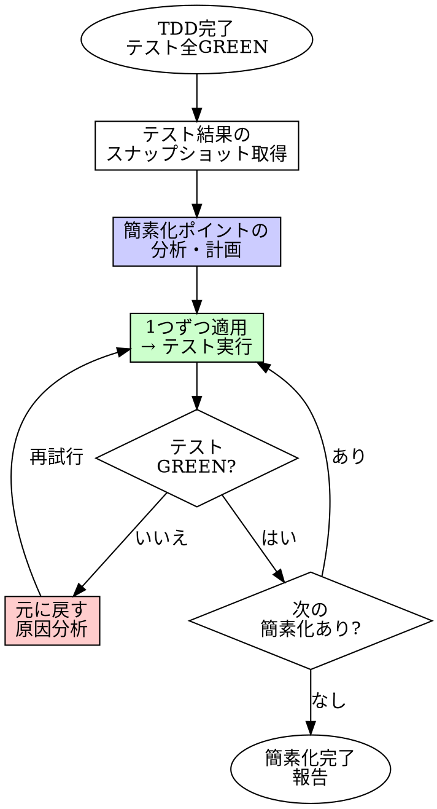

# Simplify（リファクタリング）

## 概要

テストが GREEN のまま、コードを簡素化する。
実装者とは別のエージェントが担当する。実装者バイアス（自分のコードへの愛着）を排除するため。

**入力:** REQ パス（例: `requirements/REQ-001/`）+ テスト全 GREEN の実装コード + テストコード
**出力:** 簡素化された実装コード（テスト全 GREEN 維持）

**原則:** リファクタリングとは、外から見た振る舞いを変えずに、内部構造を改善すること。

## Iron Law

```
テストが GREEN のまま簡素化せよ
```

テストが RED になった？ リファクタではない。振る舞いを壊している。元に戻せ。

- テストを書き換えてGREENにするな。それは仕様変更だ
- 「テストが邪魔だから消す」は論外
- 振る舞いの追加はリファクタではない。TDDに戻れ

TDD 完了後に simplifier による簡素化を行う。

## いつ使うか

**常に:**
- TDD 実装（ステップ [4][5]）が完了し、テストが全 GREEN の後
- code-review の前（ステップ [8] の前に品質を上げておく）
- レビュー指摘の修正後、再度コードが肥大化した場合

**例外（人間パートナーに確認すること）:**
- 1ファイル・数行の変更（TDD の REFACTOR フェーズで十分）
- 生成されたコード（スキャフォールド等）

「リファクタは後でやる」→ 後でやるリファクタは永遠に来ない。今やれ。

## プロセス



### 1. スナップショット取得

テストを実行し、現在の GREEN 状態を確認する。これがベースライン。
以降の全ステップで、この状態に戻せることを保証する。

### 2. 簡素化ポイントの分析

以下の観点でコードを分析し、簡素化の計画を立てる。

| 観点 | やること | やらないこと |
|------|---------|------------|
| **重複除去** | 同じロジックの2箇所以上を共通化 | 似ているだけのコードを無理に共通化 |
| **命名改善** | 意図を正確に表す名前に変更 | 略語を全て正式名称にする（文脈で自明なら短くてよい） |
| **構造簡素化** | ネストを浅く、関数を短く | 1行関数への過剰な分割 |
| **不要コード除去** | 使われていないコード・import を削除 | 「念のため残す」コード |
| **抽象化の適正化** | 過剰な抽象化を解体 | 未来の要件のための抽象化を追加 |

**3回ルール**: 同じパターンが2回なら許容。3回目が出たら共通化を検討する。2回で共通化するのは早すぎる抽象化。

### 3. 1つずつ適用 → テスト実行

簡素化を1つ適用するたびにテストを実行する。

- **1つずつ**: 複数の変更をまとめて適用しない。テストが RED になったとき原因が特定できなくなる
- **テスト実行**: 全テストを実行。変更したファイルに関連するテストだけではダメ
- **RED になったら即座に元に戻す**: 原因を分析し、アプローチを変えて再試行

### 4. 完了報告

全ての簡素化が完了したら、変更内容を報告する。

## よくある合理化

| 言い訳 | 現実 |
|--------|------|
| 「動いているから触るな」 | 動いているコードも読む人間がいる。読みやすさは機能 |
| 「リファクタする時間がない」 | リファクタしない時間の方が高くつく。技術的負債は複利で増える |
| 「テストを変えればGREENにできる」 | テストを変えた時点でリファクタではなく仕様変更。TDDに戻れ |
| 「全部書き直した方が早い」 | 書き直しはリファクタではない。既存テストが通る保証がない |
| 「この程度なら別にいい」 | 「この程度」が100箇所積み重なるのが技術的負債 |
| 「実装者が自分でリファクタすればいい」 | 実装者は自分のコードに愛着がある。別の目が必要 |

## 危険信号

以下のどれかに当てはまったら、**やり方を見直せ。**

- [ ] テストを書き換えて GREEN にした
- [ ] 複数の簡素化をまとめて適用した
- [ ] テストを実行せずに「大丈夫だろう」と判断した
- [ ] 振る舞いを追加した（リファクタではない）
- [ ] 新しい機能を「ついでに」入れた
- [ ] 元に戻す方法がわからない変更をした

## 例: API ハンドラの簡素化

**Before:**
```
function handleCreateUser(req, res) {
  // バリデーション
  if (!req.body.name) { return res.status(400).json({error: 'name required'}); }
  if (!req.body.email) { return res.status(400).json({error: 'email required'}); }
  if (!req.body.password) { return res.status(400).json({error: 'password required'}); }
  // ハッシュ化
  const hash = await bcrypt.hash(req.body.password, 10);
  // 保存
  const user = await db.query('INSERT INTO users ...');
  // レスポンス
  return res.status(201).json({id: user.id, name: user.name, email: user.email});
}
```

**分析:**
- バリデーションが3行の重複パターン → 共通化検討（3回ルール該当）
- ハンドラが4つの責務を持つ → 分離
- 各ステップのテストが既にある前提

**After:**
```
function validateRequired(body, fields) {
  for (const field of fields) {
    if (!body[field]) return { error: `${field} required` };
  }
  return null;
}

function handleCreateUser(req, res) {
  const error = validateRequired(req.body, ['name', 'email', 'password']);
  if (error) return res.status(400).json(error);
  const user = await createUser(req.body);
  return res.status(201).json(toUserResponse(user));
}
```

**確認:** テスト全 GREEN → 簡素化成功

## 検証チェックリスト

簡素化完了前に確認:

- [ ] 全テストが GREEN のまま（1つも RED にしていない）
- [ ] テストを書き換えていない
- [ ] 振る舞いを追加していない
- [ ] 各簡素化ステップでテストを実行した
- [ ] 不要なコード・import を除去した
- [ ] 命名が意図を正確に表している

## 行き詰まった場合

| 問題 | 解決策 |
|------|--------|
| リファクタするとテストが RED になる | 振る舞いを変えている。アプローチを変えろ。テストが正しい |
| どこを簡素化すべかわからない | 重複・長い関数・深いネストから探せ。なければ無理にやるな |
| 簡素化すると可読性が下がる | それは簡素化ではない。「短い」≠「シンプル」 |
| テストがなくて安全にリファクタできない | TDD に戻れ。テストを先に書いてからリファクタ |

## 委譲指示

あなたはこのスキルのプロセスを自分で実行しない。以下のエージェントにディスパッチする。

**前提: 対応する REQ を特定する。** ディスパッチ前に、このタスクに対応する `requirements/REQ-*/requirements.md` を特定しろ。タスクのコンテキスト（plan、直前のステップの出力）に REQ パスが含まれていればそれを使う。見つからなければ `requirements/` を確認し、候補を人間パートナーに AskUserQuestion で提示して選択してもらう。**推測で REQ を決めるな。必ず人間に確認しろ。**

1. **`test-runner` エージェントをディスパッチしてベースライン取得**
   - 現在のテストが全 GREEN であることを確認する
   - GREEN でなければ simplify に進まない。TDD に戻る

2. **`simplifier` エージェントをディスパッチする**
   - プロンプトに REQ パス + 対応する REQ の requirements.md 全文 + 対象コード + 関連テスト + ベースラインのテスト結果を含める
   - **コンテキストはプロンプトに全文埋め込む。** エージェントにファイルを読ませるな
   - `simplifier` が簡素化ポイントの分析 → 1つずつ適用 → テスト実行を繰り返す
   - `simplifier` は完了時に 4ステータス（DONE / DONE_WITH_CONCERNS / NEEDS_CONTEXT / BLOCKED）で報告する

3. **`test-runner` エージェントをディスパッチして最終確認**
   - simplifier 完了後、テストスイート全体を実行して全 GREEN を確認する

4. **あなたが結果を判断する**
   - 全テスト GREEN かつ DONE → 次のステップ（test-quality or code-review）に進む
   - DONE_WITH_CONCERNS → 懸念を確認してから判断
   - NEEDS_CONTEXT → 不足情報を補って再ディスパッチ
   - BLOCKED → エスカレーション判断ツリーに従う

## Integration

**前提スキル:**
- **tdd** — テスト全 GREEN であること。GREEN でなければ simplify に進まない

**必須ルール:**
- **coding-style** — コーディングルール（常時適用）

**次のステップ:**
- **test-quality** — 品質テストの追加
- **code-review** — 3観点レビュー

**このスキルを使うスキル:**
- **code-review** — レビュー指摘の修正後、再度コードが肥大化した場合に使用
