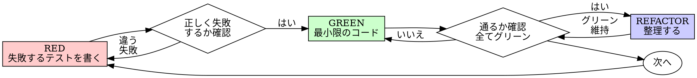

# Test-Driven Development (TDD)

## 概要

テストを先に書く。失敗を確認する。テストを通す最小限のコードを書く。

**入力:** REQ パス（例: `requirements/REQ-001/`）+ 承認済みの `requirements.md` 全文（+ `design.md` があればそれも）
**出力:** テスト全 GREEN の実装コード + テストコード

**原則:** テストが失敗するのを見ていないなら、そのテストが正しいものをテストしているかは分からない。

## Iron Law

```
失敗するテストなしにプロダクションコードを書くな
```

テストより先にコードを書いた？ 削除しろ。最初からやり直せ。

- 「参考として残す」な
- 「テストを書きながら適応させる」な
- 見るな
- 削除は削除

振る舞いの変更には実行可能な検証が必要。

## いつ使うか

**常に:**
- 新機能の実装
- バグの修正
- 振る舞いを変えるリファクタリング
- 既存コードの変更

**例外（人間パートナーに確認すること）:**
- 使い捨てのプロトタイプ
- 生成されたコード（スキャフォールド、マイグレーション）
- 設定ファイル

「今回だけ TDD をスキップ」と思った？ それは合理化だ。やめろ。

## プロセス



### RED - 失敗するテストを書く

期待する振る舞いを示すテストを1つだけ書く。

- 1テストにつき1つの振る舞い
- 振る舞いを説明する明確なテスト名
- 本物のコードをテストする（モックはやむを得ない場合のみ）

### RED確認 - 失敗を見届ける

**必須。絶対にスキップしない。**

テストを実行して確認:
- テストが失敗する（エラーではなく失敗）
- 失敗メッセージが想定通り
- 機能が未実装だから失敗している（タイポではなく）

テストが即座に通った？ 既存の振る舞いをテストしている。テストを修正しろ。

### GREEN - 最小限のコードを書く

テストを通す最も単純なコードを書く。それ以上は書かない。

機能追加、他のコードのリファクタ、テストの範囲を超えた「改善」をするな。

### GREEN確認 - 通ることを見届ける

**必須。**

テストを実行して確認:
- 新しいテストが通る
- 他の全テストも通る

テストが失敗？ コードを直せ、テストを直すな。他のテストが壊れた？ 今すぐ直せ。

### REFACTOR - 整理する

グリーンになった後だけ:
- 重複を除去
- 命名を改善
- ヘルパーを抽出

テストをグリーンに保つ。振る舞いを追加するな。

### 繰り返す

次の振る舞いに対して、次の失敗するテストを書く。

## 良いテスト

| 品質 | 良い | 悪い |
|------|------|------|
| **1つのこと** | 単一の振る舞いをテスト | テスト名に「と」がある → 分割せよ |
| **明確な名前** | 期待する振る舞いを説明 | `test1`, `testRetry` |
| **意図を示す** | 望ましいAPIを示す | コードが何をすべきか不明瞭 |
| **本物のコード** | 実際の振る舞いをテスト | 全てモックで何もテストしていない |
| **独立** | 他のテストに依存しない | 特定の実行順序が必要 |

## よくある合理化

| 言い訳 | 現実 |
|--------|------|
| 「単純すぎてテスト不要」 | 単純なコードも壊れる。テストは30秒で書ける |
| 「後でテストを書く」 | 即座に通るテストは何も証明しない |
| 「手動で確認済み」 | 場当たり的 ≠ 体系的。記録がなく再実行できない |
| 「X時間の作業を捨てるのは無駄」 | サンクコスト。検証されていないコードを残す方が負債 |
| 「参考として残す」 | 結局それに合わせる。テスト後書きと同じ。削除は削除 |
| 「まず探索が必要」 | いい。探索を捨てて、TDDで始めろ |
| 「テストが難しい = スキップ」 | テストしにくい = 使いにくい。テストの声を聞け。設計を見直せ |
| 「TDDは遅くなる」 | TDDはデバッグより速い |

## 危険信号

以下のどれかに当てはまったら、**コードを削除して TDD でやり直せ。**

- [ ] テストより先にプロダクションコードを書いた
- [ ] 実装の後にテストを書いた
- [ ] テストが即座に通った（失敗を見ていない）
- [ ] なぜテストが失敗したか説明できない
- [ ] 「今回だけ」と合理化した
- [ ] 「形式より精神が大事」と言った
- [ ] 「X時間かけたから削除はもったいない」と思った

## 例: バグ修正

**バグ:** 空のメールアドレスがフォーム送信で受け入れられる

**RED:**
```
テスト: '空のメールアドレスを拒否する'
  → email: '' でフォーム送信
  → エラー 'メールアドレスは必須です' を期待
```

**RED確認:**
```
FAIL: 'メールアドレスは必須です' を期待したが undefined を取得
  ✓ 正しい理由で失敗（バリデーションが未実装）
```

**GREEN:**
```
バリデーション追加: メールアドレスが空 → エラー 'メールアドレスは必須です' を返す
```

**GREEN確認:**
```
PASS: 全テストグリーン
```

**REFACTOR:**
複数フィールドに同様のチェックが必要なら、バリデーションを抽出する。

## 検証チェックリスト

作業完了前に確認:

- [ ] 全ての新しい関数/メソッドにテストがある
- [ ] 各テストが失敗するのを実装前に確認した
- [ ] 各テストが想定通りの理由で失敗した
- [ ] 各テストを通す最小限のコードを書いた
- [ ] 全テストが通る
- [ ] テストは本物のコードを使っている（モックはやむを得ない場合のみ）
- [ ] エッジケースとエラーパスをカバーしている

全てチェックできない？ TDDをスキップした。やり直せ。

## 行き詰まった場合

| 問題 | 解決策 |
|------|--------|
| テストの書き方が分からない | 望ましいAPIを先に書く。アサーションから書く。人間パートナーに聞く |
| テストが複雑すぎる | 設計が複雑すぎる。インターフェースを簡素化しろ |
| 全てモックしないといけない | コードの結合度が高すぎる。依存性注入を使え |
| テストのセットアップが巨大 | ヘルパーを抽出しろ。それでも複雑？ 設計を簡素化しろ |

## 委譲指示

あなたはこのスキルのプロセスを自分で実行しない。以下のエージェントにディスパッチする。

**前提: 対応する REQ を特定する。** ディスパッチ前に、このタスクに対応する `requirements/REQ-*/requirements.md` を特定しろ。タスクのコンテキスト（plan、直前のステップの出力）に REQ パスが含まれていればそれを使う。見つからなければ `requirements/` を確認し、候補を人間パートナーに AskUserQuestion で提示して選択してもらう。**推測で REQ を決めるな。必ず人間に確認しろ。**

1. **`implementer` エージェントをディスパッチする**
   - REQ パス + 対応する REQ の requirements.md 全文 + タスクの内容とコンテキスト（対象ファイル、関連コード）を全文渡す
   - `implementer` が TDD サイクル（RED→GREEN→REFACTOR）を実行する
   - `implementer` は完了時に 4ステータス（DONE / DONE_WITH_CONCERNS / NEEDS_CONTEXT / BLOCKED）で報告する

2. **`test-runner` エージェントをディスパッチする**
   - 実装完了後、`test-runner` にテストスイート全体の実行をディスパッチする
   - `test-runner` は結果を構造化して報告する

3. **あなたが結果を判断する**
   - 全テスト GREEN かつ DONE → 次のステップに進む
   - DONE_WITH_CONCERNS → 懸念を確認してから判断
   - NEEDS_CONTEXT → 不足情報を補って再ディスパッチ
   - BLOCKED → エスカレーション判断ツリーに従う

## Integration

**必須ルール:**
- **testing** — テストルール（常時適用）
- **coding-style** — コーディングルール（常時適用）

**次のステップ:**
- **simplify** — TDD 完了後のリファクタリング
- **code-review** — リファクタ後（or 直後）の3観点レビュー

**このスキルを使うスキル:**
- **code-review** — MUST 指摘の修正時に TDD サイクルで修正する
