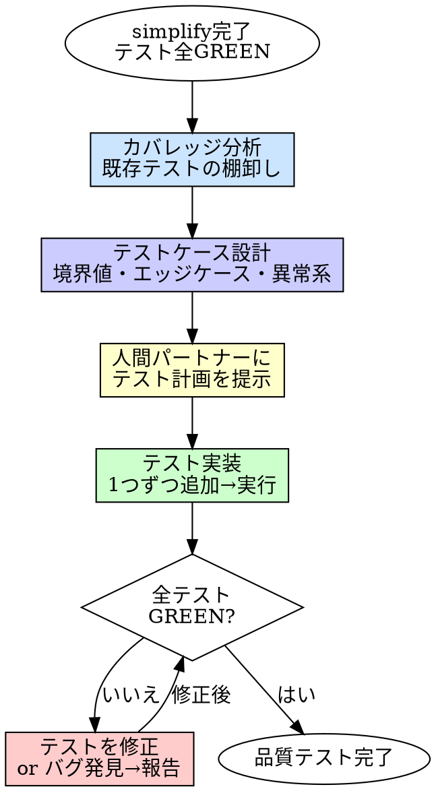

# Test Quality（品質テスト追加）

## 概要

implementer が書いた AC テストの「外側」を埋める。
テストケース設計を実装とは別の責務として分離し、テストの抜け漏れを構造的に防ぐ。

**入力:** REQ パス（例: `requirements/REQ-001/`）+ テスト全 GREEN の実装コード + テストコード + `requirements.md` 全文
**出力:** 品質テストが追加されたテストスイート（テスト全 GREEN 維持）

**原則:** AC テストは「仕様を満たすか」を検証する。品質テストは「壊れないか」を検証する。

## Iron Law

```
品質テストなしにレビューに進むな
```

AC テストが通っている ≠ テストが十分。AC は仕様のハッピーパスと主要な異常系しかカバーしない。

- 「AC テストが通っているから十分」→ 境界値でバグが出る
- 「エッジケースは後で追加」→ 後で追加されるテストは永遠に来ない
- 「レビューで指摘されてから追加する」→ レビュアーにテスト設計を押し付けるな

## いつ使うか

**常に:**
- TDD 実装（[4][5]）と simplify（[6]）が完了した後
- code-review（[8]）に進む前

**例外（人間パートナーに確認すること）:**
- 設定ファイルのみの変更
- ドキュメントのみの変更
- 自動生成コードの更新

## プロセス



### 1. カバレッジ分析（既存テストの棚卸し）

既存のテストを棚卸しし、何がカバーされていて何が抜けているかを把握する。

| 確認事項 | 観点 |
|---------|------|
| AC と FR の対応 | AC-* の Covers: FR-x を追って、全 FR にテストがあるか |
| 正常系 | ハッピーパスがカバーされているか |
| 異常系 | エラーパス（IF 条件）がカバーされているか |
| 境界値 | 入力の境界（0, 1, max, max+1, 空, null）がテストされているか |
| 型・フォーマット | 不正な型、不正なフォーマットの入力がテストされているか |
| 状態遷移 | 状態を持つ場合、遷移の各パスがテストされているか |
| 組み合わせ | 複数の入力・条件の組み合わせがテストされているか |

### 2. テストケース設計

分析結果に基づき、追加すべきテストケースを設計する。

#### テストケースの分類

| 分類 | 説明 | 例 |
|------|------|----|
| **境界値** | 入力の境界とその前後 | 0, 1, -1, MAX_INT, MAX_INT+1 |
| **エッジケース** | 特殊な入力・状態 | 空文字列, null, undefined, 空配列, 巨大入力 |
| **異常系** | エラーが発生すべき入力 | 不正な型, 範囲外, 権限不足 |
| **組み合わせ** | 複数条件の交差 | フラグA=true かつ フラグB=false の場合 |
| **並行性** | 並行アクセスの安全性 | 同時更新, レースコンディション |
| **冪等性** | 同じ操作の繰り返し | 2回目の呼び出しが安全か |

全分類を網羅する必要はない。実装の性質に応じて、該当する分類だけを設計する。

#### テストケース設計のフォーマット

```
## 追加テストケース

### 境界値
- TQ-1: [入力が0の場合、XXXを返す]
- TQ-2: [入力がMAX_INTの場合、XXXを返す]

### エッジケース
- TQ-3: [空文字列の場合、エラーを返す]

### 異常系
- TQ-4: [不正な型の場合、TypeErrorをスローする]

### 組み合わせ
- TQ-5: [フラグAがtrueかつ入力が空の場合、デフォルト値を使用する]
```

### 3. 人間パートナーにテスト計画を提示

設計したテストケース一覧を人間パートナーに提示し、承認を得る。

- 追加テストケース数が多い（10件超）場合、優先度をつけて提示する
- 人間パートナーが「ここは不要」と判断したテストケースは除外する
- 人間パートナーが「これも追加して」と言ったテストケースを追加する

### 4. テスト実装

承認されたテストケースを1つずつ実装する。

- **1つずつ**: テストを1つ追加 → 実行を繰り返す
- **テストが RED になった場合**: 2つの可能性がある
  - **テストが間違っている**: テストを修正する
  - **バグを発見した**: バグとして報告する。テストは RED のまま残す（修正は implementer の仕事）
- **既存テストが壊れた場合**: 追加したテストが原因でないか確認。原因なら元に戻す

### バグ発見時の対応

品質テストで実装のバグが見つかった場合:

1. バグを再現するテストを RED のまま残す
2. 完了報告で DONE_WITH_CONCERNS として報告し、バグの内容を記載する
3. バグ修正は test-quality-engineer の責務ではない。TDD に戻って implementer が修正する

## 良いテストケース設計

| 品質 | 良い | 悪い |
|------|------|------|
| **意図が明確** | テスト名だけで何を検証しているかわかる | `testEdgeCase1`, `testBoundary` |
| **独立** | 他のテストに依存しない | 特定の実行順序が必要 |
| **最小限** | 1テスト1振る舞い | 1テストで複数の条件を検証 |
| **再現可能** | 入力と期待出力が明確 | ランダムな入力に依存 |
| **保守可能** | 実装詳細ではなく振る舞いをテスト | 内部状態を直接検証 |

## よくある合理化

| 言い訳 | 現実 |
|--------|------|
| 「ACテストで十分」 | AC はハッピーパスと主要異常系のみ。境界値は別途必要 |
| 「カバレッジ100%だからOK」 | 行カバレッジ100%でもバグは出る。パスカバレッジ・条件カバレッジが重要 |
| 「境界値は自明」 | 自明な境界値でバグが出るのが一番多い |
| 「テストが多すぎると保守が大変」 | 保守が大変なのはテストが多いからではなく、テストが実装詳細に依存しているから |
| 「後でE2Eテストで確認する」 | E2Eテストはフィードバックが遅い。ユニットテストで先に捕まえろ |

## 危険信号

以下のどれかに当てはまったら、**やり方を見直せ。**

- [ ] 既存テストの棚卸しをせずにテストを追加した
- [ ] テストケースを設計せずにいきなり実装した
- [ ] バグを見つけたのにテストを GREEN に合わせた（テストを妥協した）
- [ ] 既存テストを書き換えた
- [ ] 実装コードを修正した（test-quality-engineer の責務ではない）
- [ ] 全分類を無理に網羅しようとした（実装の性質に合っていない）

## 例: ユーザー登録API

**既存テスト（AC由来）:**
```
- AC-1: 有効な入力で登録成功
- AC-2: メールアドレスなしでエラー
- AC-3: 既に存在するメールアドレスでエラー
```

**カバレッジ分析:**
```
- 境界値: パスワード長の最小/最大が未テスト
- エッジケース: メールアドレスの不正フォーマットが未テスト
- 異常系: DB接続エラー時の挙動が未テスト
- 組み合わせ: 複数フィールドが同時に不正な場合が未テスト
```

**追加テストケース:**
```
- TQ-1: パスワードが最小長（8文字）の場合、登録成功
- TQ-2: パスワードが最小長-1（7文字）の場合、エラー
- TQ-3: パスワードが最大長（128文字）の場合、登録成功
- TQ-4: メールアドレスが不正フォーマット（@なし）の場合、エラー
- TQ-5: 名前とメールアドレスが両方空の場合、両方のエラーを返す
```

## 検証チェックリスト

品質テスト完了前に確認:

- [ ] 既存テストの棚卸しを実施した
- [ ] テストケースを設計してから実装した
- [ ] 人間パートナーにテスト計画を提示し承認を得た
- [ ] 追加テストを1つずつ実装・実行した
- [ ] 既存テストが壊れていない
- [ ] バグ発見時はテストを RED のまま報告した（実装を修正していない）
- [ ] テストケースの分類（TQ-*）が明確

## 行き詰まった場合

| 問題 | 解決策 |
|------|--------|
| 何をテストすべかわからない | 境界値分析から始めろ。入力の型ごとに境界を洗い出す |
| テストケースが多すぎる | 優先度をつけて人間パートナーに相談。境界値 > エッジケース > 組み合わせ |
| バグが大量に見つかった | 設計に根本的な問題がある可能性。人間パートナーにエスカレート |
| テストが書きにくい | テストしにくい = 設計が複雑すぎる。TDD に戻って設計を見直す提案をしろ |
| 既存テストの意図がわからない | requirements.md の AC と FR を突き合わせろ。それでもわからなければ人間に聞く |

## 委譲指示

あなたはこのスキルのプロセスを自分で実行しない。以下のエージェントにディスパッチする。

**前提: 対応する REQ を特定する。** ディスパッチ前に、このタスクに対応する `requirements/REQ-*/requirements.md` を特定しろ。タスクのコンテキスト（plan、直前のステップの出力）に REQ パスが含まれていればそれを使う。見つからなければ `requirements/` を確認し、候補を人間パートナーに AskUserQuestion で提示して選択してもらう。**推測で REQ を決めるな。必ず人間に確認しろ。**

1. **`test-runner` エージェントをディスパッチしてベースライン取得**
   - 現在のテストが全 GREEN であることを確認する
   - GREEN でなければ test-quality に進まない。TDD に戻る

2. **`test-quality-engineer` エージェントをディスパッチする**
   - プロンプトに REQ パス + 対応する REQ の requirements.md 全文 + 対象コード + 既存テストコード + ベースラインのテスト結果を含める
   - **コンテキストはプロンプトに全文埋め込む。** エージェントにファイルを読ませるな
   - `test-quality-engineer` がカバレッジ分析 → テストケース設計 → 人間承認 → 実装を実行する
   - `test-quality-engineer` は完了時に 4ステータス（DONE / DONE_WITH_CONCERNS / NEEDS_CONTEXT / BLOCKED）で報告する

3. **`test-runner` エージェントをディスパッチして最終確認**
   - test-quality-engineer 完了後、テストスイート全体を実行して全テスト通ることを確認する

4. **あなたが結果を判断する**
   - 全テスト GREEN かつ DONE → 次のステップ（code-review）に進む
   - DONE_WITH_CONCERNS → バグが見つかった場合、TDD に戻って implementer に修正させる
   - NEEDS_CONTEXT → 不足情報を補って再ディスパッチ
   - BLOCKED → エスカレーション判断ツリーに従う

## Integration

**前提スキル:**
- **tdd** — テスト全 GREEN であること
- **simplify** — 簡素化済みであること（推奨）

**必須ルール:**
- **testing** — テストルール（常時適用）

**次のステップ:**
- **code-review** — 品質テスト完了後の3観点レビュー

**このスキルを使うスキル:**
- **code-review** — MUST 指摘の修正後、テスト追加が必要な場合に使用
