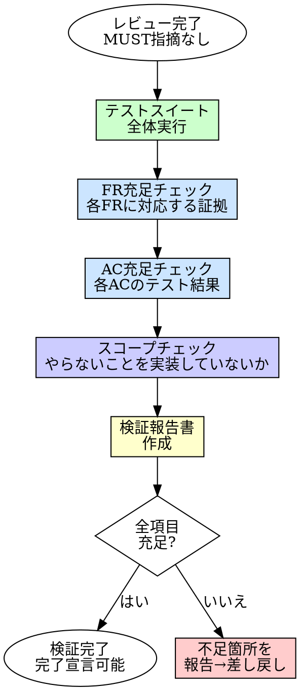

# Verification（完了検証）

## 概要

「完了した」と言える根拠を作る。
テストが通る、レビューが通った、だけでは完了ではない。要件を全て満たし、スコープを逸脱していないことを証拠付きで確認する。

**入力:** REQ パス（例: `requirements/REQ-001/`）+ レビュー完了済みの実装コード + テストコード + `requirements.md` 全文 + レビュー報告
**出力:** 検証報告書（全 FR/AC の充足証拠 + スコープ確認 + 最終テスト結果）

**原則:** 「テストが通っている」は検証ではない。「要件が全て満たされている」が検証だ。

## Iron Law

```
検証証拠なしに完了を宣言するな
```

レビューが通った ≠ 完了。レビューは品質を検証する。verification は要件充足を検証する。

- 「テスト全 GREEN だから完了」→ テストが要件を全てカバーしているとは限らない
- 「レビューで指摘がなかったから完了」→ レビュアーが見落としている可能性がある
- 「動いているから完了」→ 何が動いているかの定義がない

## いつ使うか

**常に:**
- code-review（[8]）が完了した後
- コミット・PR（[11]）に進む前

**例外（人間パートナーに確認すること）:**
- ドキュメントのみの変更
- 設定ファイルのみの変更

## プロセス



### 1. テストスイート全体実行

全テストを実行し、GREEN であることを確認する。

- RED のテストがある場合、verification に進まない。差し戻す
- テスト実行のログを証拠として記録する

### 2. FR 充足チェック

requirements.md の各 FR（機能要件）に対して、実装が存在する証拠を確認する。

| 確認項目 | 方法 |
|---------|------|
| FR の振る舞い（WHEN） | 対応するコードが実装されているか |
| FR の異常系（IF） | エラーハンドリングが実装されているか |
| FR の入力/出力 | インターフェースが仕様通りか |

各 FR に対して「充足 / 未充足 / 部分充足」を判定する。

### 3. AC 充足チェック

requirements.md の各 AC（受け入れ条件）に対して、テストが存在し通っている証拠を確認する。

| 確認項目 | 方法 |
|---------|------|
| AC に対応するテストの存在 | テストコード内で AC の Given/When/Then に対応するテストを特定 |
| テストの結果 | テスト実行結果で GREEN であることを確認 |
| Covers 対応 | AC の Covers: FR-x が正しく対応しているか |

各 AC に対して「テストあり GREEN / テストあり RED / テストなし」を判定する。

### 4. スコープチェック

requirements.md の「やらないこと」「スコープ外」に記載された項目が実装されていないことを確認する。

- decisions.md がある場合、除外判断された項目も確認する
- スコープ外の機能が実装されている場合、報告する

### 5. 検証報告書の作成

全チェック結果を検証報告書としてまとめる。

#### 検証報告書のフォーマット

```
# 検証報告書

## テスト結果
- 実行日時: [YYYY-MM-DD HH:MM]
- テスト数: [N件]
- 結果: 全GREEN / N件RED

## FR 充足状況
| FR | 状態 | 証拠 |
|----|------|------|
| FR-1 | 充足 | [対応するコード・テストの要約] |
| FR-2 | 充足 | [対応するコード・テストの要約] |

## AC 充足状況
| AC | Covers | テスト | 結果 |
|----|--------|--------|------|
| AC-1 | FR-1 | test_xxx | GREEN |
| AC-2 | FR-1 | test_yyy | GREEN |

## スコープ確認
- スコープ外の実装: なし / [あれば詳細]

## 判定
- [PASS: 全項目充足、完了宣言可能]
- [FAIL: 不足箇所あり、差し戻し]
```

## よくある合理化

| 言い訳 | 現実 |
|--------|------|
| 「テストが通っているから検証不要」 | テストが要件の全てをカバーしているとは限らない |
| 「レビューが通ったから大丈夫」 | レビューは品質の検証。要件充足の検証は別 |
| 「小さい変更だから検証は省略」 | 小さい変更でも要件との乖離は起きる |
| 「動作確認は手動でやった」 | 記録がなければ証拠にならない。再現もできない |
| 「前回と同じパターンだから」 | 同じパターンでも要件が違えば検証項目も違う |

## 危険信号

以下のどれかに当てはまったら、**検証をやり直せ。**

- [ ] テストを実行せずに「通るはず」と判断した
- [ ] FR/AC との突き合わせをせずに完了とした
- [ ] スコープ外の確認をスキップした
- [ ] 検証報告書を作成していない
- [ ] 「前のステップで確認済み」と言って検証を省略した

## 例: ユーザー登録API

**FR 充足チェック:**
```
| FR | 状態 | 証拠 |
|----|------|------|
| FR-1: ユーザー登録 | 充足 | POST /users 実装済み、createUser関数でバリデーション→保存→レスポンス |
| FR-2: メール重複チェック | 充足 | findByEmail で既存ユーザー検索、409 Conflict 返却 |
| FR-3: パスワードハッシュ化 | 充足 | bcrypt.hash(password, 10) で保存前にハッシュ化 |
```

**AC 充足チェック:**
```
| AC | Covers | テスト | 結果 |
|----|--------|--------|------|
| AC-1: 有効な入力で登録成功 | FR-1 | test_create_user_success | GREEN |
| AC-2: メールなしでエラー | FR-1 | test_create_user_no_email | GREEN |
| AC-3: 重複メールでエラー | FR-2 | test_create_user_duplicate | GREEN |
```

**判定:** PASS — 全 FR 充足、全 AC テスト GREEN、スコープ外実装なし

## 検証チェックリスト

検証完了前に確認:

- [ ] テストスイート全体を実行し GREEN を確認した
- [ ] 全 FR の充足状況を確認した
- [ ] 全 AC に対応するテストの存在と GREEN を確認した
- [ ] スコープ外の実装がないことを確認した
- [ ] 検証報告書を作成した

## 行き詰まった場合

| 問題 | 解決策 |
|------|--------|
| FR に対応するコードが見つからない | 未実装の FR がある。TDD に差し戻す |
| AC に対応するテストがない | テストが漏れている。test-quality に差し戻す |
| スコープ外の機能が実装されている | 人間パートナーに報告。削除するか要件に追加するか判断を仰ぐ |
| requirements.md が不明確で判定できない | 人間パートナーに仕様の明確化を依頼する |

## 委譲指示

あなたはこのスキルのプロセスを自分で実行しない。以下のエージェントにディスパッチする。

**前提: 対応する REQ を特定する。** ディスパッチ前に、このタスクに対応する `requirements/REQ-*/requirements.md` を特定しろ。タスクのコンテキスト（plan、直前のステップの出力）に REQ パスが含まれていればそれを使う。見つからなければ `requirements/` を確認し、候補を人間パートナーに AskUserQuestion で提示して選択してもらう。**推測で REQ を決めるな。必ず人間に確認しろ。**

1. **`test-runner` エージェントをディスパッチしてテスト全体実行**
   - テストスイート全体を実行し、結果を取得する
   - RED のテストがある場合、verification に進まない

2. **`verifier` エージェントをディスパッチする**
   - プロンプトに REQ パス + 対応する REQ の requirements.md 全文 + テスト実行結果 + 実装コード + テストコード + レビュー報告を含める
   - **コンテキストはプロンプトに全文埋め込む。** エージェントにファイルを読ませるな
   - `verifier` が FR 充足チェック → AC 充足チェック → スコープチェック → 検証報告書作成を実行する
   - `verifier` は完了時に 4ステータス（DONE / DONE_WITH_CONCERNS / NEEDS_CONTEXT / BLOCKED）で報告する

3. **あなたが結果を判断する**
   - PASS（全項目充足）かつ DONE → 次のステップ（cleanup）に進む
   - FAIL（不足あり）→ 不足の種類に応じて差し戻す:
     - FR 未充足 → TDD に差し戻す
     - AC テストなし → test-quality に差し戻す
     - スコープ逸脱 → 人間パートナーに判断を仰ぐ
   - NEEDS_CONTEXT → 不足情報を補って再ディスパッチ
   - BLOCKED → エスカレーション判断ツリーに従う

4. **あなた（コーディネーター）が検証証拠を記録する**
   - verifier の報告を受けて、**あなたが** `.claude/harness/last-verification.json` に Write ツールで書き出す
   - verifier は Write 権限を持たない。証拠ファイルの書き出しはコーディネーターの責務
   - フォーマット: `{"status": "PASS"|"FAIL", "timestamp": "ISO8601", "reason": "要約", "req_path": "REQ パス"}`
   - このファイルは verification-gate フックが git commit 前に参照する

## Integration

**前提スキル:**
- **code-review** — 3観点レビュー完了、MUST 指摘なし

**必須ルール:**
- **testing** — テストルール（常時適用）

**次のステップ:**
- **cleanup** — 検証完了後の不要ファイル整理

**このスキルの出力を参照するエージェント:**
- 検証報告書はコミットメッセージ・PR 本文の根拠として使用される
