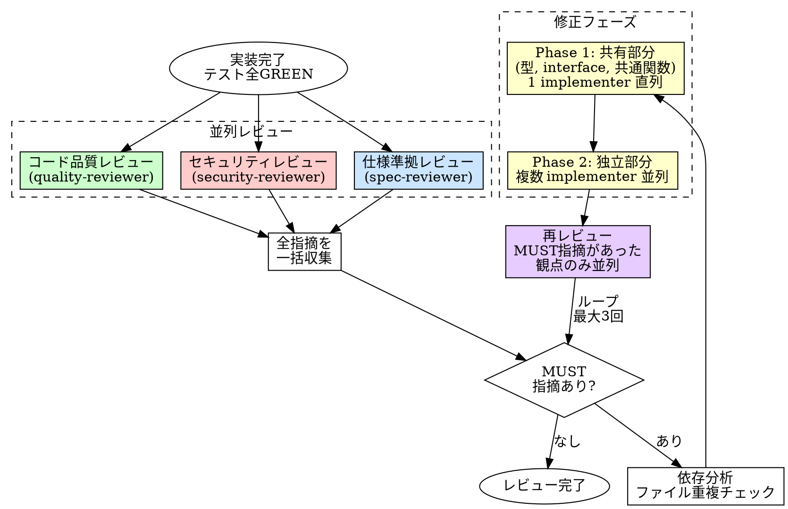

# Code Review（3観点レビュー）

## 概要

実装者とは別のエージェントが、3つの独立した観点でコードをレビューする。
実装者バイアスを排除し、仕様との乖離・品質劣化・脆弱性を検出する。

**原則:** 実装した者がレビューしても、自分の思い込みは見つけられない。

## Iron Law

```
3観点レビュー（仕様→品質→セキュリティ）を省略するな
```

1段階でも飛ばした？ それはレビューではない。チェックリストの消化だ。

- 「仕様レビューは不要、自明だから」→ 自明なバグが一番多い
- 「セキュリティは関係ない」→ 関係ないと思った箇所が攻撃される
- 「小さい変更だから品質レビューは省略」→ 小さい変更が技術的負債を積む

**HARD GATE**: タスクサイズによらず常時必須。

## いつ使うか

**常に:**
- 機能実装の完了後
- バグ修正の完了後
- リファクタリングの完了後

**例外（人間パートナーに確認すること）:**
- ドキュメントのみの変更
- 設定ファイルのみの変更
- 自動生成コードの更新

## プロセス



### 並列レビュー（3観点同時実行）

3つのレビュアーは独立した観点を持つ。同じコードを読むだけ（read-only）なので並列実行する。

#### 仕様準拠レビュー（spec-reviewer）

実装が要件・仕様を満たしているかを検証する。

- 要件に記載された全機能が実装されているか
- エッジケース・異常系が要件通りに処理されているか
- API の入出力が仕様と一致しているか
- テストが仕様の振る舞いをカバーしているか

#### コード品質レビュー（quality-reviewer）

コードの保守性・可読性・設計品質を検証する。

- 命名は意図を正確に表しているか
- 関数・モジュールの責務は単一か
- 不要な複雑さ（過剰な抽象化、不要なパターン適用）がないか
- 重複コードがないか
- エラーハンドリングは適切か

#### セキュリティレビュー（security-reviewer）

セキュリティ上の脆弱性がないかを検証する。

- OWASP Top 10（インジェクション、認証不備、XSS 等）
- シークレット・認証情報のハードコード
- 入力バリデーションの不備
- 安全でないデシリアライゼーション
- 過剰な権限・情報露出

### 修正フェーズ（依存解決パターン）

MUST 指摘がある場合、修正前に依存分析を行う。

1. **依存分析**: 全 MUST 指摘の affected files を洗い出し、ファイル重複をチェック
2. **Phase 1 — 共有部分を直列修正**: 型定義・interface・共通関数など、複数の指摘が依存する共有レイヤーを 1 implementer で先に修正する
3. **Phase 2 — 独立部分を並列修正**: ファイルが重複しない指摘群を複数 implementer で並列修正する

MUST 指摘が少数（3件以下）かつ affected files が少ない場合は、依存分析をスキップして 1 implementer にまとめて渡してよい。

## レビューループ上限

```
修正 → 再レビュー: 最大3回
3回修正しても通らない場合:
  ├─ 仕様レビュー不合格 → タスク分割を検討 or 人間エスカレート
  └─ 品質/セキュリティレビュー不合格 → Opus で1回リトライ → ダメなら人間エスカレート
```

最大4回（通常3回 + モデルエスカレート1回）で打ち切り。
無限ループに入るな。3回目の修正で同じ指摘が出たら、根本的な設計問題だ。

## 良いレビュー指摘

| 品質 | 良い | 悪い |
|------|------|------|
| **具体的** | 「L42: null チェックが漏れている。`user` が undefined の場合に例外が発生する」 | 「エラーハンドリングが甘い」 |
| **修正案付き** | 問題 + 修正の方向性を提示 | 問題の指摘だけで終わる |
| **根拠あり** | ルール・仕様・脆弱性 DB を根拠に指摘 | 「なんとなく良くない」 |
| **優先度明示** | MUST / SHOULD / CONSIDER で分類 | 全部同じ重みで列挙 |
| **再現可能** | 具体的な入力やシナリオで再現手順を示す | 「こういうケースがありそう」 |

## よくある合理化

| 言い訳 | 現実 |
|--------|------|
| 「テストが通っているからレビュー不要」 | テストは仕様の一部しかカバーしない。レビューは別の観点を持つ |
| 「小さい変更だからスキップ」 | 1行の変更でセキュリティホールは作れる |
| 「急いでいるからレビューは後で」 | 後でやるレビューは永遠に来ない |
| 「自分でレビューした」 | 実装者バイアスで自分のミスは見えない |
| 「セキュリティは内部ツールだから関係ない」 | 内部ツールも攻撃対象になる。SSRF、権限昇格 |
| 「前回と同じパターンだからレビュー不要」 | 同じパターンでも文脈が違えばバグは違う |

## 危険信号

以下のどれかに当てはまったら、**レビュープロセスをやり直せ。**

- [ ] 3観点のうち1つでもスキップした
- [ ] レビュー指摘を「些細だから」と無視した
- [ ] 修正後に再レビューせず完了とした
- [ ] レビュアーに十分なコンテキストを渡していない
- [ ] MUST 指摘が残ったままマージしようとした
- [ ] 「今回だけ」と合理化した

## 例: API エンドポイント追加

**Stage 1 - 仕様準拠レビュー:**
```
MUST: POST /users のレスポンスに id フィールドがない（仕様では必須）
SHOULD: エラーレスポンスの形式が仕様の ErrorResponse スキーマと不一致
```

**Stage 2 - 品質レビュー:**
```
MUST: createUser 関数が80行。バリデーション・変換・保存を分離せよ
SHOULD: userRouter 内の重複したエラーハンドリングをミドルウェアに抽出
CONSIDER: DTO と Entity の変換を専用関数に分離
```

**Stage 3 - セキュリティレビュー:**
```
MUST: req.body をバリデーションなしで直接 DB クエリに使用（SQLインジェクション）
MUST: パスワードが平文で保存されている
SHOULD: レスポンスに内部エラーの詳細が露出（スタックトレース）
```

## 検証チェックリスト

レビュー完了前に確認:

- [ ] 3観点全て（仕様→品質→セキュリティ）を実行した
- [ ] 各段階のレビュアーに十分なコンテキストを渡した
- [ ] MUST 指摘は全て修正された
- [ ] 修正後に該当段階の再レビューを実施した
- [ ] SHOULD 指摘は修正されたか、妥当な理由で保留された
- [ ] レビューループが4回以内で完了した

## 行き詰まった場合

| 問題 | 解決策 |
|------|--------|
| 仕様が不明確でレビューできない | 人間パートナーに仕様の明確化を依頼する |
| 同じ指摘が修正後も繰り返される | 設計に根本的な問題がある。タスク分割か設計見直し |
| レビュー指摘が大量すぎる | MUST だけ先に修正。SHOULD は次のイテレーション |
| セキュリティ判断に自信がない | security-reviewer に具体的な攻撃シナリオを生成させる |

## 委譲指示

あなたはこのスキルのプロセスを自分で実行しない。以下のエージェントにディスパッチする。

1. **3レビュアーを並列ディスパッチする**
   - 以下のエージェントを名前指定で同時にディスパッチする（`.claude/agents/` で自動発見される）:
     - `spec-reviewer`: プロンプトにコード差分 + 要件・仕様 + 関連テストを含める
     - `quality-reviewer`: プロンプトにコード差分 + 関連ファイルを含める
     - `security-reviewer`: プロンプトにコード差分 + 関連ファイルを含める
   - **コンテキストはプロンプトに全文埋め込む。** エージェントにファイルを読ませるな

2. **あなたが全指摘を一括収集し、MUST 指摘を確認する**
   - MUST 指摘なし → レビュー完了
   - MUST 指摘あり → 修正フェーズに進む

3. **修正フェーズ: 依存分析してから `implementer` をディスパッチする**
   - 全 MUST 指摘の affected files を洗い出す
   - MUST 指摘が少数（3件以下）かつ affected files が少ない → 1 implementer にまとめて渡す
   - MUST 指摘が多い場合:
     - **Phase 1**: 共有部分（型、interface、共通関数）の指摘を 1 implementer にディスパッチ（直列）
     - **Phase 2**: 独立部分（ファイル重複なし）の指摘群を複数 implementer に並列ディスパッチ

4. **修正後、MUST 指摘があった観点のみ再レビューする**
   - 該当するレビュアーだけを並列ディスパッチする（全観点やり直す必要はない）
   - 修正→再レビューは最大3回まで
   - 3回で解決しない → モデルエスカレート1回 → ダメなら人間エスカレート
   - 全観点の MUST 指摘が解消 → レビュー完了

## 関連ファイル

- **エージェント定義**（`.claude/agents/`）:
  - `spec-reviewer.md` — 仕様準拠レビュアー（Opus, read-only）
  - `quality-reviewer.md` — コード品質レビュアー（Opus, read-only）
  - `security-reviewer.md` — セキュリティレビュアー（Opus, read-only）
  - `implementer.md` — 修正実装（Sonnet, write 可）
- **ルール**: `core/rules/security.md`（常時適用）
- **手動起動**: `/review` で直接呼び出し可能
- **ワークフロー**: [8] レビュー
- **前提**: [4][5] TDD 完了（テスト全 GREEN）
