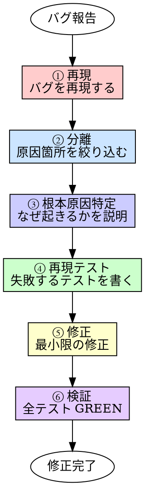

# Debugging（バグ調査・修正）

## 概要

バグを報告されたら、まず再現し、根本原因を特定してから修正する。
推測で修正するな。「たぶんここだろう」で直したコードは別のバグを生む。

**入力:** REQ パス（例: `requirements/REQ-001/`）+ バグ報告（症状、再現手順、期待結果と実際の結果）
**出力:** 根本原因の特定 + 再現テスト + 修正済みコード（テスト全 GREEN）

**原則:** 根本原因を特定せずに修正するのは、症状を隠しているだけだ。

## Iron Law

```
根本原因を特定せずに修正するな
```

「動いたからOK」→ なぜ動くようになったか説明できるか？ できないなら根本原因を見つけていない。

- 「エラーが消えたから直った」→ エラーを握り潰しただけかもしれない
- 「たぶんここが原因」→ 「たぶん」で修正するな。証拠を出せ
- 「前にもこのパターンだった」→ 前と同じとは限らない。確認しろ

## いつ使うか

**常に:**
- バグ報告を受けたとき
- テストが失敗したとき（原因が不明な場合）
- 本番で障害が発生したとき

**このスキルは随時発動する。** ワークフローの特定のステップではなく、いつでも必要に応じて使う。

## プロセス



### ① 再現（バグを再現する）

バグ報告の症状を手元で再現する。再現できなければ修正できない。

- バグ報告の再現手順に従う
- 再現できない → 追加情報を人間パートナーに求める
- 環境依存の可能性を確認（OS、バージョン、設定）

### ② 分離（原因箇所を絞り込む）

バグの原因箇所を絞り込む。

| 手法 | 使い方 |
|------|--------|
| **二分探索** | 入力を半分に分けて、どちらで再現するか確認 |
| **最小再現** | 再現する最小のコード・入力を特定 |
| **差分確認** | 「いつから壊れたか」を git bisect やコミット履歴で特定 |
| **ログ・出力確認** | 中間状態を確認して、どこで期待と乖離するかを特定 |

### ③ 根本原因特定（なぜ起きるかを説明する）

原因箇所がわかったら、**なぜ**そのバグが起きるかを説明する。

```
根本原因: [1文で説明]
詳細: [なぜこのコードでこの症状が出るかの説明]
証拠: [ログ、中間値、テスト結果など]
```

「ここを変えたら直る」ではなく「ここがこうなっているから、この入力でこの症状が出る」を説明できること。

### ④ 再現テスト（TDD で修正する）

根本原因に対する再現テストを書く。**テストが先。修正は後。**

- テストはバグの症状を再現する（修正前は RED）
- テストが RED であることを実行して確認する
- テストが正しい理由で失敗していることを確認する

### ⑤ 修正（最小限の修正）

再現テストを通す最小限の修正を行う。

- 根本原因に対する修正だけをする
- 「ついでに」他の箇所を直さない
- リファクタは修正とは別（simplify に任せる）

### ⑥ 検証（全テスト GREEN）

修正後、テストスイート全体を実行する。

- 再現テストが GREEN になること
- 他のテストが壊れていないこと
- 壊れた場合、修正が副作用を起こしている → 修正を見直す

## よくある合理化

| 言い訳 | 現実 |
|--------|------|
| 「再現できないから修正できない」 | 再現手順を人間に聞け。環境差異を疑え |
| 「たぶんここだから直す」 | 推測で直すな。証拠を出せ |
| 「エラーが消えたから直った」 | エラーを握り潰しただけかもしれない |
| 「時間がないから応急処置」 | 応急処置した箇所を Issue に残せ。根本修正は必ず後で |
| 「前にも同じパターンだった」 | 前と同じとは限らない。確認しろ |

## 危険信号

以下のどれかに当てはまったら、**やり方を見直せ。**

- [ ] 再現せずに修正しようとした
- [ ] 根本原因を説明できないまま修正した
- [ ] 再現テストを書かずに修正した
- [ ] 修正後にテストスイート全体を実行していない
- [ ] 「たぶん」「おそらく」で修正内容を決めた
- [ ] 修正箇所以外も「ついでに」直した

## 検証チェックリスト

修正完了前に確認:

- [ ] バグを再現した
- [ ] 根本原因を特定し、なぜ起きるか説明できる
- [ ] 再現テストを書き、修正前に RED であることを確認した
- [ ] 最小限の修正を行った
- [ ] 再現テストが GREEN になった
- [ ] テストスイート全体が GREEN

## 行き詰まった場合

| 問題 | 解決策 |
|------|--------|
| 再現できない | 人間パートナーに追加情報を求める。環境差異を疑う |
| 原因箇所が絞り込めない | 二分探索で範囲を狭める。最小再現を作る |
| 根本原因が複数ありそう | 1つずつ検証する。複合原因なら分解して個別にテストする |
| 修正すると他のテストが壊れる | 修正の副作用。設計の問題の可能性。人間パートナーに相談 |

## 委譲指示

あなたはこのスキルのプロセスを自分で実行しない。以下のエージェントにディスパッチする。

**前提: 対応する REQ を特定する。** ディスパッチ前に、このタスクに対応する `requirements/REQ-*/requirements.md` を特定しろ。タスクのコンテキスト（plan、直前のステップの出力）に REQ パスが含まれていればそれを使う。見つからなければ `requirements/` を確認し、候補を人間パートナーに AskUserQuestion で提示して選択してもらう。**推測で REQ を決めるな。必ず人間に確認しろ。**

1. **`debugger` エージェントをディスパッチする**
   - プロンプトに REQ パス + 対応する REQ の requirements.md 全文 + バグ報告（症状、再現手順、期待結果と実際の結果）+ 関連コード・テストを含める
   - **コンテキストはプロンプトに全文埋め込む。** エージェントにファイルを読ませるな
   - `debugger` が ①再現 → ②分離 → ③根本原因特定 → ④再現テスト → ⑤修正 → ⑥検証 を実行する
   - `debugger` は完了時に 4ステータス（DONE / DONE_WITH_CONCERNS / NEEDS_CONTEXT / BLOCKED）で報告する

2. **`test-runner` エージェントをディスパッチして最終確認**
   - debugger 完了後、テストスイート全体を実行して全 GREEN を確認する

3. **あなたが結果を判断する**
   - 全テスト GREEN かつ DONE → 修正完了
   - DONE_WITH_CONCERNS → 懸念を確認してから判断
   - NEEDS_CONTEXT → 不足情報（再現手順等）を補って再ディスパッチ
   - BLOCKED → エスカレーション判断ツリーに従う

## Integration

**必須ルール:**
- **testing** — テストルール（常時適用）
- **coding-style** — コーディングルール（常時適用）

**このスキルが使う他のスキル:**
- **tdd** — 再現テスト → 修正のサイクルは TDD そのもの

**このスキルを使うスキル:**
- **test-quality** — 品質テストでバグが見つかった場合に使用
- **code-review** — レビュー指摘でバグが発見された場合に使用
