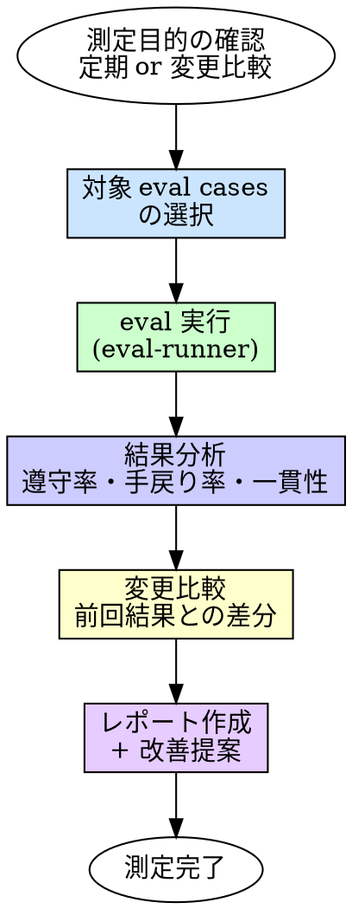

# Eval（振り返り・効果測定）

## 概要

ハーネス（スキル・エージェント・ルール）が期待通りに機能しているかを測定する。
感覚ではなく数値で判断し、改善ループを回すための根拠を作る。

**入力:** 測定対象の eval cases（`eval/cases/*.yaml`）+ 測定の目的（定期測定 / ハーネス変更後の比較）
**出力:** 測定結果レポート（遵守率・手戻り率・一貫性 + 改善提案）

**原則:** 測定しないものは改善できない。

## Iron Law

```
ハーネス変更を測定なしにデプロイするな
```

スキル・エージェント・ルールを変更した？ 変更前後の eval を比較しろ。

- 「良くなったはず」→ 数値で示せ
- 「悪くなるはずがない」→ 測定して証明しろ
- 「eval は後で回す」→ 後で回す eval は永遠に来ない

## いつ使うか

**常に:**
- スキル・エージェント・ルールを変更した後（変更前後の比較）
- 定期的な効果測定（週次・月次）

**トリガー（将来実装）:**
- Stop フックでセッション終了時に自動起動

**例外（人間パートナーに確認すること）:**
- eval cases 自体の変更（eval で eval を測定する循環を避ける）

## プロセス



### 1. 対象 eval cases の選択

| 測定目的 | 対象 |
|---------|------|
| 定期測定 | `eval/cases/` 内の全 eval cases |
| ハーネス変更後 | 変更したスキル・ルールに対応する eval cases |

### 2. eval 実行

eval cases を promptfoo で実行する。

各テストケースの判定方法（eval/README.md 準拠）:
1. **決定的チェック** — `not-contains`, `regex` 等の文字列マッチ
2. **LLM-as-Judge** — `llm-rubric` による品質判定
3. **人間スポットチェック** — 結果の 10-20% を人間が確認（定期測定時のみ）

### 3. 結果分析

| 指標 | 計算方法 | 意味 |
|------|---------|------|
| **遵守率** | pass 数 / 全テスト数 | ルール・プロセスを守っているか |
| **手戻り率** | 1回目で pass した数 / 全テスト数 | 一発で正しい行動を取れるか |
| **一貫性** | pass^k（k=3 で同じテストを3回実行） | 毎回同じ結果を出せるか |

### 4. 変更比較（ハーネス変更時のみ）

変更前後の結果を比較し、リグレッションがないことを確認する。

```
## 変更比較

| eval case | 変更前 | 変更後 | 差分 |
|-----------|--------|--------|------|
| tdd-enforcement | 6/7 (86%) | 7/7 (100%) | +14% |
| code-review-enforcement | 7/7 (100%) | 7/7 (100%) | ±0% |
```

- 遵守率が下がった eval case がある → リグレッション。変更を見直す
- 全指標が維持 or 改善 → 変更を承認

### 5. レポート作成

#### 測定結果レポートのフォーマット

```
# Eval 測定結果レポート

## 概要
- 測定日時: [YYYY-MM-DD HH:MM]
- 測定目的: [定期測定 / ハーネス変更後]
- 対象: [eval cases の一覧]

## 結果サマリー
| 指標 | 値 |
|------|-----|
| 遵守率 | [N/M (XX%)] |
| 手戻り率 | [N/M (XX%)] |
| 一貫性 | [pass^3 = XX%]（実施した場合） |

## eval case 別結果
| eval case | pass | fail | 遵守率 |
|-----------|------|------|--------|
| [case名] | [N] | [M] | [XX%] |

## 失敗したテスト
- [case名 > test名]: [失敗理由の要約]

## 変更比較（該当時のみ）
[変更前後の差分テーブル]

## 改善提案
- [提案1: 失敗パターンから特定した改善点]
- [提案2: ...]
```

## よくある合理化

| 言い訳 | 現実 |
|--------|------|
| 「eval は時間がかかる」 | 測定しないリグレッションの方が時間がかかる |
| 「変更は小さいから測定不要」 | 小さい変更がリグレッションを起こす |
| 「前回100%だったから今回も大丈夫」 | 環境・コンテキストが違えば結果も違う |
| 「LLM-as-Judge は不安定」 | だから一貫性（pass^k）も測る。不安定さ自体が指標 |

## 危険信号

以下のどれかに当てはまったら、**やり方を見直せ。**

- [ ] ハーネスを変更したのに eval を実行していない
- [ ] 遵守率が下がったのに変更をデプロイした
- [ ] eval cases 自体を pass するように書き換えた
- [ ] 結果を分析せずに「pass 率 XX%」だけ報告した
- [ ] 失敗したテストの原因を調べずに放置した

## 検証チェックリスト

測定完了前に確認:

- [ ] 対象の eval cases を全て実行した
- [ ] 遵守率・手戻り率を算出した
- [ ] 失敗したテストの原因を分析した
- [ ] ハーネス変更時は変更前後の比較を行った
- [ ] リグレッションがないことを確認した
- [ ] 測定結果レポートを作成した

## 行き詰まった場合

| 問題 | 解決策 |
|------|--------|
| eval cases がない | 新しいスキル/ルールに対応する eval cases を先に作る |
| pass 率が低すぎる | スキル/ルールの記述が曖昧な可能性。失敗パターンからスキルを改善する |
| 結果が不安定 | 一貫性テスト（pass^3）で不安定さを定量化し、プロンプトの曖昧さを特定する |
| 変更前の結果がない | まず現状のベースラインを取得してから変更する |

## 委譲指示

あなたはこのスキルのプロセスを自分で実行しない。以下のエージェントにディスパッチする。

1. **`eval-runner` エージェントをディスパッチする**
   - プロンプトに測定目的 + 対象 eval cases のパス一覧を含める
   - ハーネス変更後の比較の場合、変更前の結果（`eval/results/` 内）のパスも含める
   - **コンテキストはプロンプトに全文埋め込む。** エージェントにファイルを読ませるな
   - `eval-runner` が eval 実行 → 結果分析 → レポート作成を実行する
   - `eval-runner` は完了時に 4ステータス（DONE / DONE_WITH_CONCERNS / NEEDS_CONTEXT / BLOCKED）で報告する

2. **あなたが結果を判断する**
   - 全指標維持 or 改善 かつ DONE → 完了
   - リグレッションあり → 変更元のスキル/ルール/エージェントの見直しを提案
   - DONE_WITH_CONCERNS → 懸念を確認してから判断
   - NEEDS_CONTEXT → 不足情報を補って再ディスパッチ
   - BLOCKED → エスカレーション判断ツリーに従う

## Integration

**前提スキル:**
- なし（独立して実行可能）

**必須ルール:**
- なし

**トリガー（将来実装）:**
- **Stop フック** — セッション終了時に自動起動

**このスキルの出力を参照するもの:**
- ハーネス改善の判断根拠として使用される
